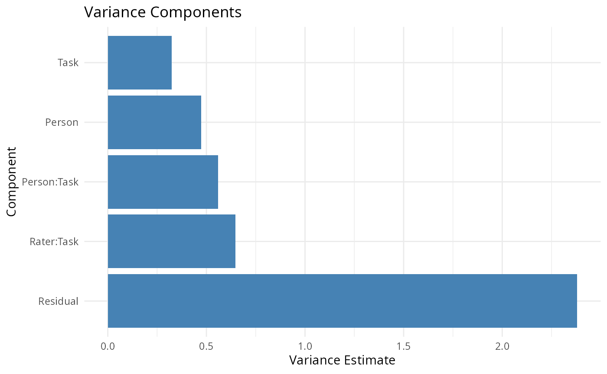

# Get Started with facet

## Introduction

The `facet` package provides a unified framework for Generalizability
Theory (G-Theory). In this quick start, we will walk through a standard
analysis: conducting a G-study, and then running a D-study.

### 1. Load the Package and Data

First, load `facet` and one of the built-in datasets, `brennan`.

``` r
library(facet)
data(brennan)
head(brennan)
#>   Task Person Rater Score y
#> 1    1      1     1     5 5
#> 2    1      2     1     9 9
#> 3    1      3     1     3 3
#> 4    1      4     1     7 7
#> 5    1      5     1     9 9
#> 6    1      6     1     3 3
```

**Reading the data.** The `brennan` dataset has one row per observation:
10 persons × 3 tasks × 4 raters per task = 120 rows. Each row records
one rater’s score for one person on one task. This is a *nested* design:
the same four raters do not rate every task; rather, each task has its
own panel of raters (so `Rater:Task` is the right way to write the
random effect, not just `Rater`). The `Score` column is the observed
rating; the other three columns identify which cell of the design the
row belongs to.

### 2. Conduct a G-Study

Use the
[`gstudy()`](https://github.com/yourorg/facet/reference/gstudy.md)
function to estimate variance components. By default, `facet` uses
`lme4` (Restricted Maximum Likelihood) under the hood.

``` r
g_obj <- gstudy(Score ~ (1 | Person) + (1 | Task) + (1 | Rater:Task) +
  (1 | Person:Task),
  data = brennan)

# View the variance components
print(g_obj)
#> Generalizability Study (G-Study)
#> ================================
#> 
#> Backend: lme4 
#> Formula: Score ~ (1 | Person) + (1 | Task) + (1 | Rater:Task) + (1 | Person:Task) 
#> Number of observations: 120 
#> Multivariate: No 
#> 
#> Object of measurement: Person 
#> Facets: Person, Task, Rater 
#> 
#> Sample Sizes:
#> # A tibble: 6 × 3
#>   effect             type            n
#>   <chr>              <chr>       <dbl>
#> 1 Person             main           10
#> 2 Task               main            3
#> 3 Rater:Task         interaction    12
#> 4 Person:Task        interaction    30
#> 5 Person:Rater (res) residual      120
#> 6 Rater per Task     nested          4
#> 
#> Nested details:
#>   Rater per Task: 3 Tasks, 4.0 Raters per Task
#> 
#> Variance Components:
#> # A tibble: 5 × 3
#>   component   estimate   pct
#>   <chr>          <dbl> <dbl>
#> 1 Person         0.473 10.8 
#> 2 Task           0.325  7.42
#> 3 Rater:Task     0.647 14.8 
#> 4 Person:Task    0.56  12.8 
#> 5 Residual       2.38  54.3
```

**Interpreting the variance components.** The output shows four variance
components: `Person` (universe score variance — true differences between
persons), `Task` (differences in average difficulty across tasks),
`Rater:Task` (differences in leniency/severity between raters within a
task), and `Person:Task` (the interaction — whether a person performs
better on some tasks than others). The “pct” column shows what fraction
of total variance each component accounts for. A healthy measurement has
a large `Person` component (typically \>30%) and a small `Person:Task`
interaction (the test is fair across tasks). If a facet is taking up a
large fraction of variance, that is the facet to invest more levels in
(more tasks, more raters) for your next measurement campaign.

### 3. Visualize Variance Components

Plotting the random effects helps identify which facets contribute the
most variance.

``` r
plot(g_obj)
```



**Reading the variance plot.** Each bar represents a variance component,
and the height shows its magnitude (on the variance or proportion scale
depending on the `type` argument). The most useful patterns to look for:
(1) a tall `Person` bar means your instrument is good at distinguishing
individuals; (2) a tall facet bar (e.g., `Task` or `Rater:Task`) means
that facet is a major source of error and you should add more levels of
it; (3) similar heights across components suggest a balanced design
where no single facet dominates. Compare the bar heights to the “pct”
column from step 2 to confirm the relative contributions.

### 4. Conduct a D-Study

A Decision (D) study calculates the dependability of your measurement
design. You can project how changing the sample sizes of your facets
impacts reliability.

``` r
# Project a design with 3 Tasks and 4 Raters
d_obj <- dstudy(g_obj, n = list(Task = 3, Rater = 4))

print(d_obj)
#> Decision Study (D-Study)
#> ========================
#> 
#> Based on G-Study with lme4 backend
#> Object of measurement: Person 
#> Universe components: Person 
#> Error components for relative error (sigma2_delta): Person:Task, Person:Rater (Residual) 
#> Error components for absolute error (sigma2_delta_abs): Task, Rater:Task, Person:Task, Person:Rater (Residual) 
#> 
#> Sample Sizes:
#>  Task: 3
#>  Rater: 4
#> 
#> Variance Components:
#> # A tibble: 5 × 6
#>   component   dim   var_unscaled pct_unscaled var_scaled pct_scaled
#>   <chr>       <chr>        <dbl>        <dbl>      <dbl>      <dbl>
#> 1 Person      Score        0.473        10.8       0.473      33.4 
#> 2 Task        Score        0.325         7.41      0.108       7.65
#> 3 Rater:Task  Score        0.647        14.8       0.054       3.80
#> 4 Person:Task Score        0.56         12.8       0.187      13.2 
#> 5 Residual    Score        2.38         54.3       0.595      42.0 
#> 
#> Coefficients:
#>    dim   uni sigma2_delta sigma2_delta_abs     g   phi
#>  Score 0.473        0.782            0.944 0.377 0.334
```

**Interpreting the D-study output.** Two coefficients are reported:
**G** (generalizability coefficient, for relative decisions like “rank
these persons”) and **Phi** (dependability coefficient, for absolute
decisions like “did this person meet the standard?”). Conventional
thresholds: G ≥ 0.80 for high-stakes decisions (selection,
certification), G ≥ 0.70 for medium-stakes (formative feedback, progress
monitoring), G ≥ 0.60 for low-stakes research. Phi is always ≤ G; the
gap between them tells you how much absolute-error variance (e.g.,
task-difficulty shifts) is contributing. If the projected G is below
your target, the next step is to run a sweep — vary `n` across multiple
values to find the smallest design that achieves the reliability you
need.

### Next Steps

For comprehensive documentation, see
[`vignette("introduction")`](https://github.com/yourorg/facet/articles/introduction.md),
which covers:

- Historical foundations of generalizability theory
- All three estimation backends (MOM, REML, Bayesian)
- Univariate and multivariate G-studies and D-studies
- Value Added Ratios and composite score optimization
- Advanced topics, reporting guidelines, and exercises
