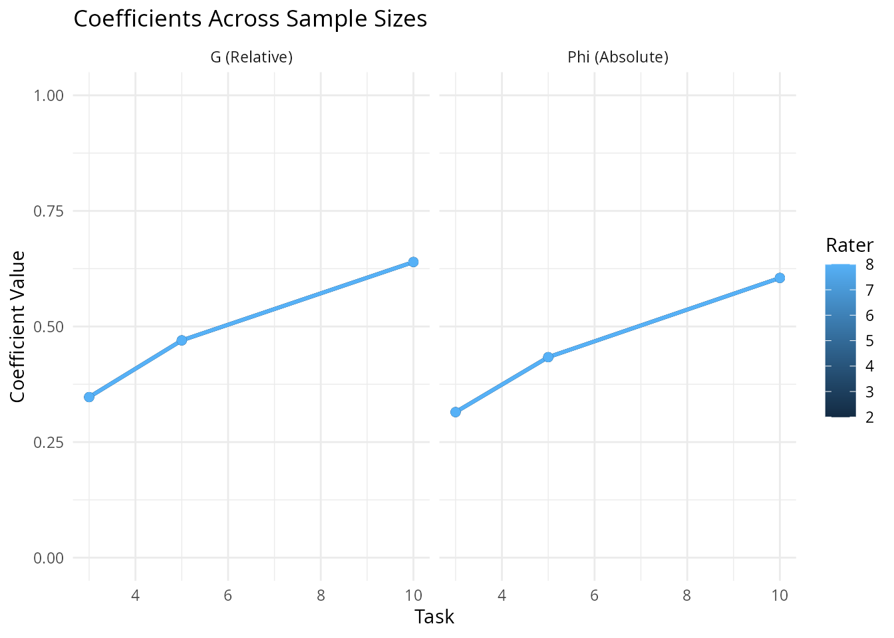
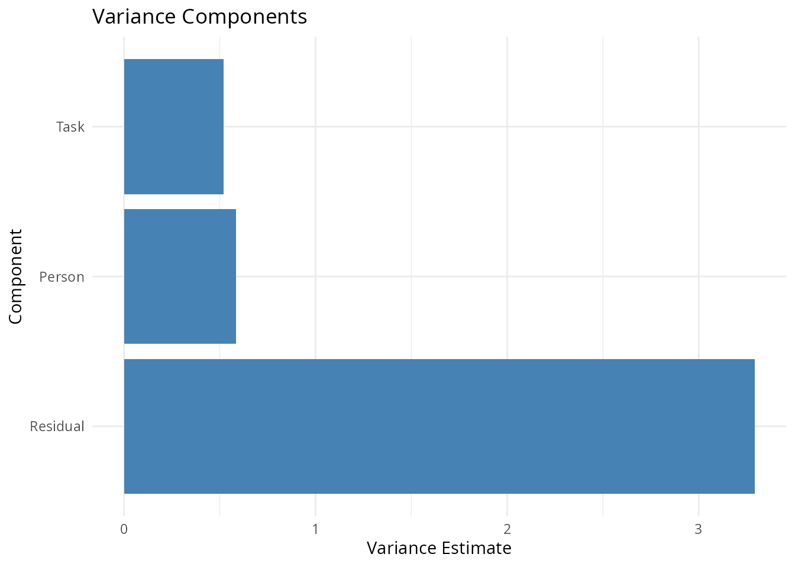
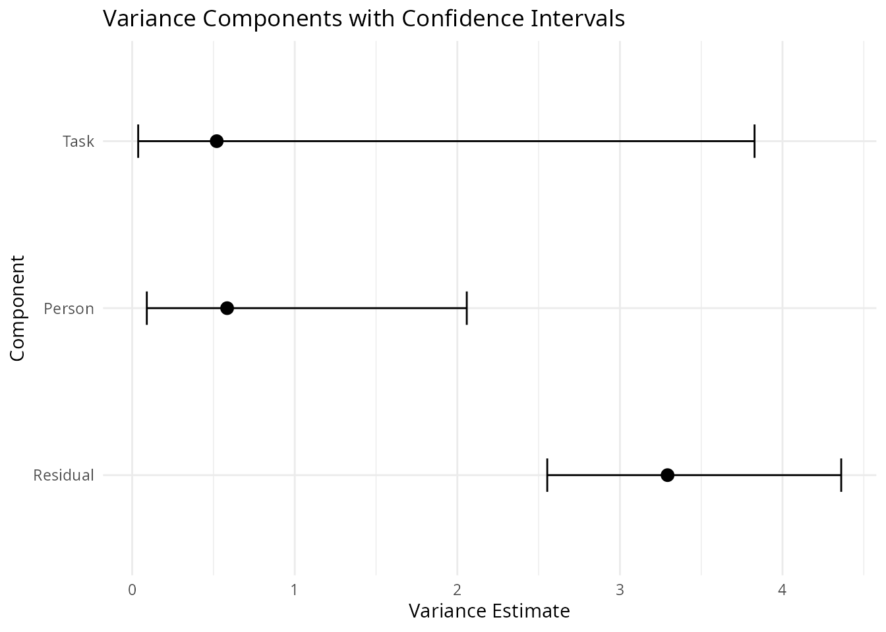
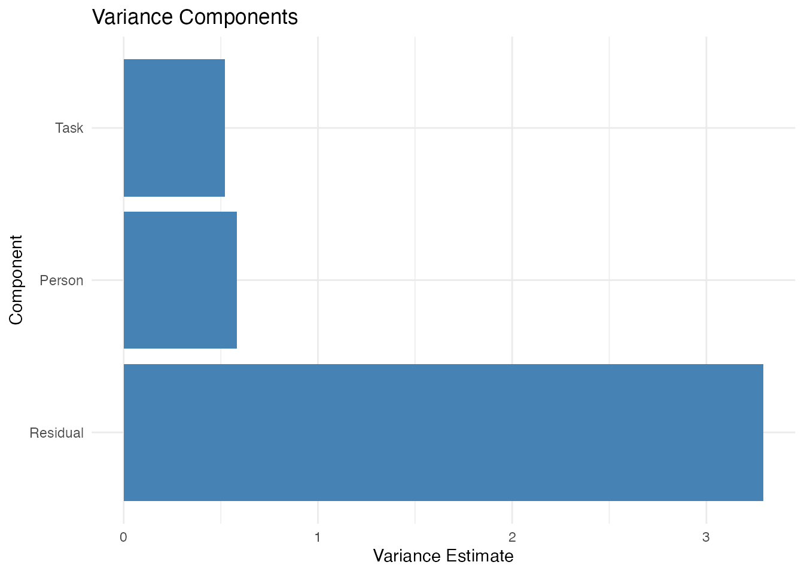
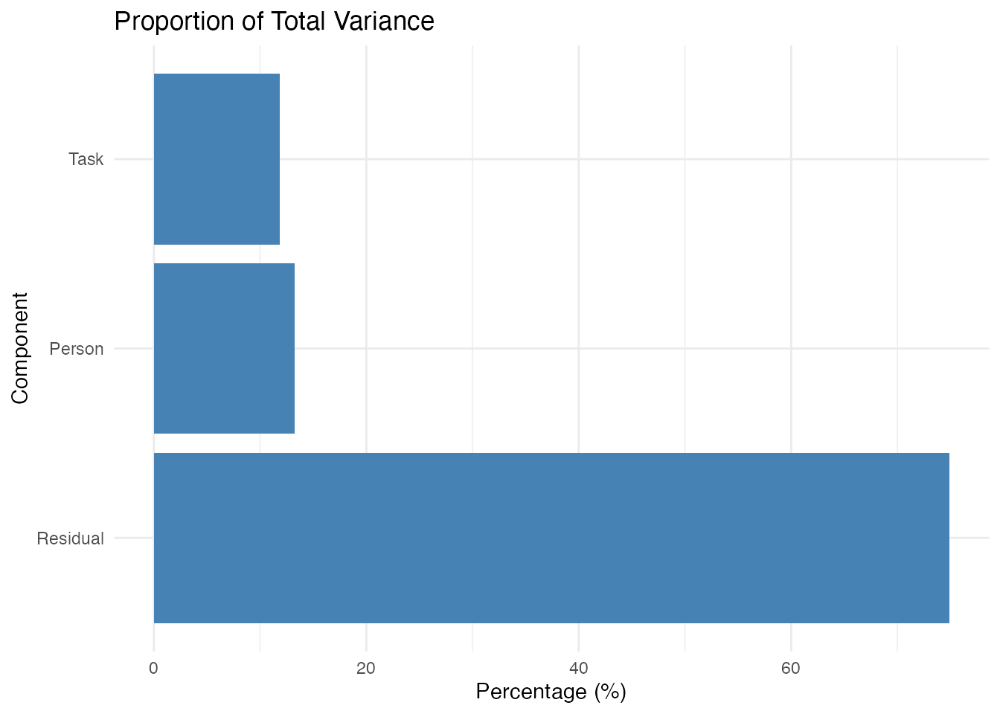
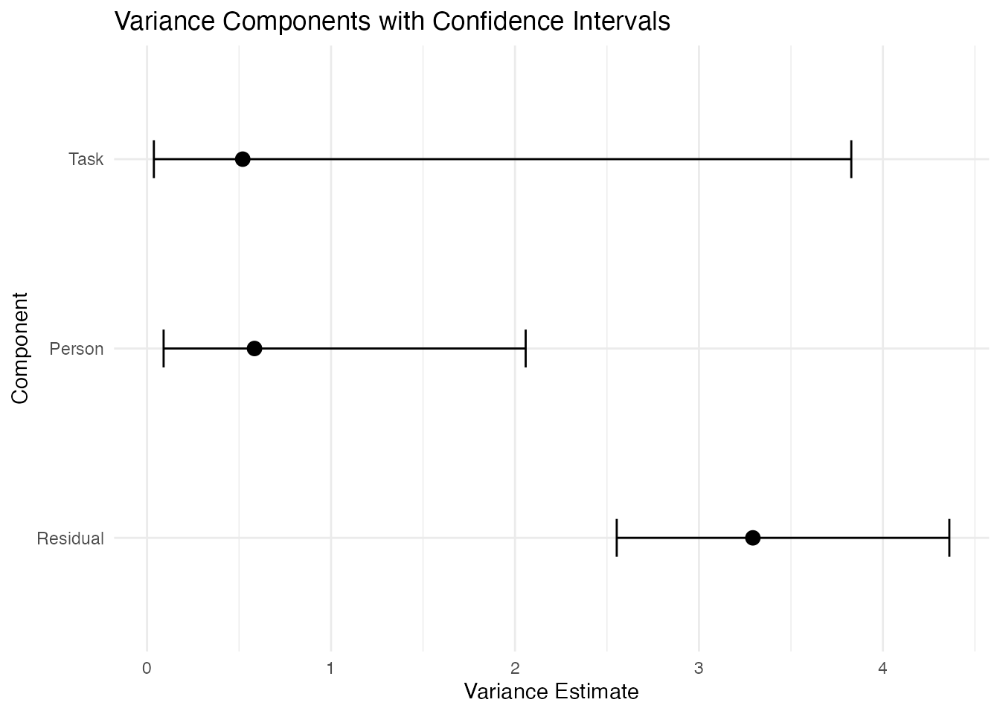
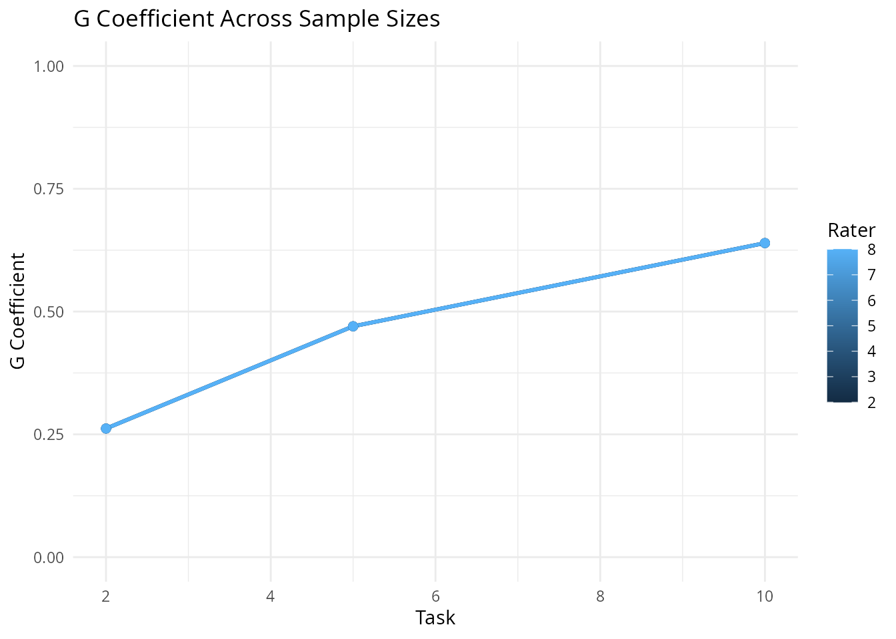
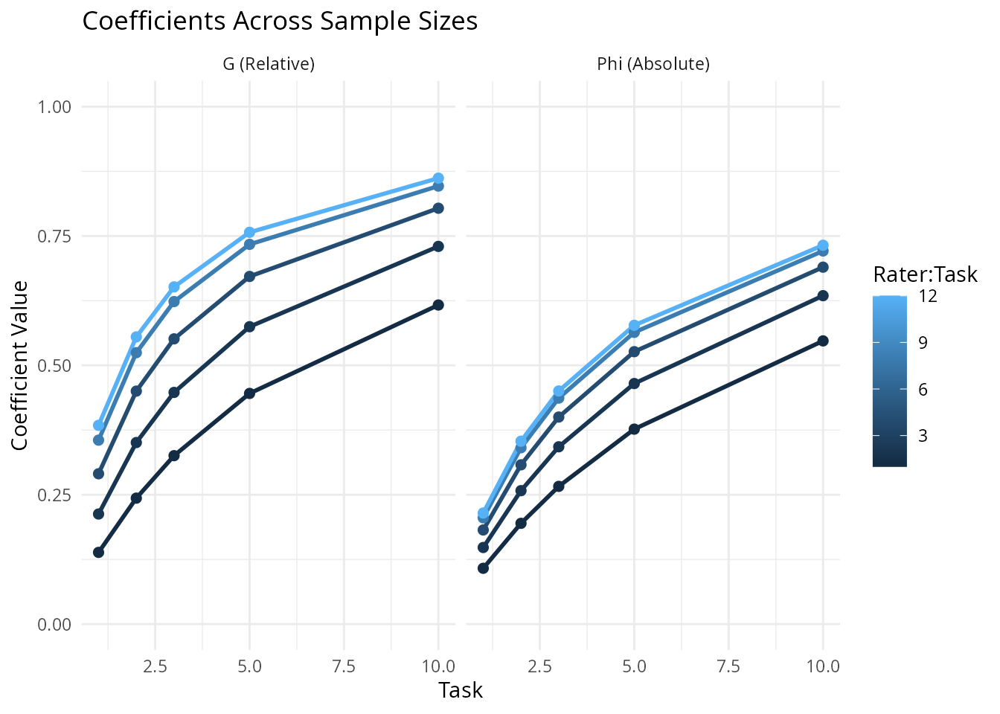

# Using facet for Generalizability Theory

## Introduction to Generalizability Theory

Generalizability Theory (G-theory) is a comprehensive framework for
understanding the reliability of measurements. Developed by Cronbach and
colleagues (Cronbach et al., 1963, 1972; Cronbach, Gleser, Nanda, &
Rajaratnam, 1972), G-theory extends Classical Test Theory (CTT) by
recognizing that measurement error is not monolithic but arises from
multiple sources. This allows researchers to examine how different
facets of a measurement design—such as items, raters, tasks, or
occasions—contribute to measurement error, and to optimize future
measurement procedures accordingly.

The **facet** package provides comprehensive tools for conducting
G-theory analyses using variance component models. It supports three
estimation backends: frequentist approaches using **lme4** (Restricted
Maximum Likelihood) and **mom** (Method of Moments/ANOVA-based), and
Bayesian estimation using **brms** (No-U-Turn Sampler/Hamiltonian Monte
Carlo via Stan). The package provides a unified interface for univariate
and multivariate designs, with full support for G-studies, D-studies,
and coefficient calculations with uncertainty quantification.

### Historical Context and Foundations

#### Foundational Works in Generalizability Theory

The theoretical foundations of generalizability theory were established
through a series of landmark publications:

**Cronbach, Rajaratnam, & Gleser (1963)** introduced the core concept of
“universes of admissible observations” and established the distinction
between relative and absolute error, providing the theoretical framework
that unified various approaches to reliability estimation. This paper
liberated reliability theory from the constraints of parallel forms,
recognizing that measurement could be generalized across multiple facets
of observation.

**Cronbach, Gleser, Nanda, & Rajaratnam (1972)** provided the definitive
treatment of G-theory in their seminal book *The Dependability of
Behavioral Measurements*. This work extended G-theory to multivariate
designs, introducing variance-covariance matrix estimation for multiple
dimensions and establishing the mathematical framework for profile
reliability and composite score generalizability.

**Rajaratnam, Cronbach, & Gleser (1965)** extended the framework to
stratified-parallel tests, developing the nested facet notation (e.g.,
items nested within subtests) that remains standard in G-theory notation
today.

**Brennan (2001)** synthesized these developments into *Generalizability
Theory*, the modern comprehensive treatment that covers unbalanced
designs, multivariate extensions, and computational methods. This text
remains the definitive reference for G-theory methodology.

**Shavelson & Webb (1991, 2006)** made G-theory accessible to applied
researchers through their primer *Generalizability Theory: A Primer*,
which has introduced generations of researchers to G-theory concepts
through clear explanations and practical examples.

#### Computational History and Software Development

The computational implementation of G-theory has evolved through several
generations:

**Early Methods (1960s-1970s)**: Initial G-theory analyses relied on
hand calculations or general-purpose ANOVA programs (BMDP, SPSS, SAS),
limiting applications to balanced designs. Researchers had to compute
variance components manually from expected mean squares.

**GENOVA (1983)**: Brennan’s GENOVA program was the first dedicated
G-theory software, implementing ANOVA-based variance component
estimation for crossed and nested designs. This made G-theory practical
for the first time, though it required balanced data.

**urGENOVA and mGENOVA (2001)**: Brennan extended the software suite to
handle unbalanced designs (urGENOVA) and multivariate analyses
(mGENOVA), significantly expanding the scope of practical G-theory
applications.

**William P. Vispoel** made seminal contributions to G-theory
accessibility through his comparative software reviews (Vispoel, 1998,
2000), evaluating programs like GENOVA and providing practical guidance
for researchers selecting appropriate computational tools. Vispoel also
advanced multivariate G-theory applications in personality assessment
(Vispoel & Cook, 1994), demonstrating how G-theory can separate multiple
sources of variance in multi-trait, multi-method designs.

**G_String** provides a modern graphical interface built around
urGENOVA, making G-theory accessible without command-line expertise
(Bloch & Norman, 2012). This Java-based tool has been particularly
valuable in medical education contexts.

**Modern R Packages**: Contemporary implementations integrate G-theory
with mixed-effects modeling frameworks. The **facet** package continues
this tradition by providing an R implementation with three estimation
backends (ANOVA/MOM, REML, Bayesian) and full support for univariate and
multivariate designs, leveraging the computational efficiency of modern
tools like lme4 and Stan.

#### From Classical Test Theory to Generalizability Theory

Classical Test Theory decomposes an observed score $`X`$ into a true
score $`T`$ and measurement error $`e`$:

``` math
X = T + e
```

The reliability coefficient in CTT, typically Cronbach’s alpha,
represents the proportion of observed score variance attributable to
true score variance. However, this approach treats all measurement error
as undifferentiated—it cannot distinguish between error due to different
sources (e.g., items vs. raters) or inform decisions about how to
improve measurement precision.

G-theory addresses these limitations by partitioning observed score
variance into components attributable to different facets of
measurement. Instead of a single reliability coefficient, G-theory
provides:

1.  **Variance components** quantifying the contribution of each facet
    to total variance
2.  **Generalizability (G) coefficients** for relative decisions
    (rank-ordering objects)
3.  **Dependability (Phi) coefficients** for absolute decisions
    (comparing to standards)

#### Key Concepts

**Facets** are the sources of measurement error in a design. Common
facets include:

- **Items**: Questions or tasks administered
- **Raters**: Judges or observers scoring responses
- **Tasks**: Different performance activities
- **Occasions**: Times of measurement
- **Forms**: Parallel versions of an instrument

The **object of measurement** is what we seek to measure—typically
persons (individuals, students, patients, etc.). The distinction between
facets and the object is crucial: facets are sources of error we seek to
control, while the object is the target of inference.

The **universe of admissible observations** defines the set of all
acceptable measurement conditions. A G-study estimates variance
components from a sample of observations; a D-study uses these estimates
to project reliability for different measurement designs within the
universe.

**Variance components** are estimated from a mixed-effects model. For a
simple person $`\times`$ item design:

``` math
X_{pi} = \mu + \mu_p + \mu_i + \mu_{pi} + e_{pi}
```

Where:

- $`\mu`$ is the grand mean
- $`\mu_p`$ is the effect of person $`p`$
- $`\mu_i`$ is the effect of item $`i`$
- $`\mu_{pi}`$ is the person $`\times`$ item interaction
- $`e_{pi}`$ is residual error

Each effect has an associated variance component: $`\sigma^2_p`$,
$`\sigma^2_i`$, $`\sigma^2_{pi}`$, and $`\sigma^2_e`$.

**G-studies** (generalizability studies) estimate variance components
from observed data. The goal is to understand how much variance is
attributable to each facet.

**D-studies** (decision studies) use G-study variance components to
project reliability for different measurement designs. By varying the
number of levels of each facet (e.g., number of items, raters),
researchers can identify designs that achieve desired reliability levels
efficiently.

### Univariate Generalizability Theory

#### Model Specification

For a univariate design with person crossed with item:

``` math
X_{pi} = \mu + \tau_p + \alpha_i + (\tau\alpha)_{pi} + e_{pi}
```

The variance components are:

- $`\sigma^2_\tau`$ (person variance): Universe score variance,
  reflecting true differences
- $`\sigma^2_\alpha`$ (item variance): Variance due to differences in
  item difficulty
- $`\sigma^2_{\tau\alpha}`$ (person $`\times`$ item): Interaction
  variance
- $`\sigma^2_e`$ (residual): Unexplained variance

#### Relative and Absolute Error

G-theory distinguishes between two types of measurement error:

**Relative error** ($`\delta`$) affects rank-ordering of persons. For a
crossed design:

``` math
\sigma^2_\delta = \frac{\sigma^2_{\tau\alpha}}{n_i} + \frac{\sigma^2_e}{n_i}
```

Relative error includes components that involve the object of
measurement—variance that causes persons’ scores to shift relative to
each other.

**Absolute error** ($`\Delta`$) affects the absolute magnitude of
scores:

``` math
\sigma^2_\Delta = \frac{\sigma^2_\alpha}{n_i} + \frac{\sigma^2_{\tau\alpha}}{n_i} + \frac{\sigma^2_e}{n_i}
```

Absolute error includes all facets except the object, because any
systematic facet effect shifts the observed mean away from the true
mean.

#### Reliability Coefficients

The **generalizability coefficient** (G coefficient, $`E\rho^2`$)
quantifies reliability for relative decisions:

``` math
E\rho^2 = \frac{\sigma^2_\tau}{\sigma^2_\tau + \sigma^2_\delta}
```

The **dependability coefficient** (Phi coefficient, $`\Phi`$) quantifies
reliability for absolute decisions:

``` math
\Phi = \frac{\sigma^2_\tau}{\sigma^2_\tau + \sigma^2_\Delta}
```

Both coefficients range from 0 to 1, with higher values indicating
greater reliability. The Phi coefficient is always less than or equal to
the G coefficient because absolute error includes more sources of
variance.

#### Crossed and Nested Designs

In a **crossed design**, all levels of one facet appear with all levels
of another. A person $`\times`$ item crossed design ($`p \times i`$)
means all persons respond to all items.

In a **nested design**, levels of one facet appear with only one level
of another. If items are nested within subtests ($`i:s`$), each item
appears in only one subtest.

The variance component structure differs for nested designs. For items
nested in subtests:

``` math
X_{ps i} = \mu + \tau_p + \sigma_s + \iota_{i:s} + (\tau\sigma)_{ps} + (\tau\iota)_{p i:s} + e_{ps i}
```

The nesting relationship affects how variance components are interpreted
and how they contribute to error variance.

### Multivariate Generalizability Theory

#### Historical Development of Multivariate G-Theory

The extension of G-theory to multiple dimensions was first developed in
**Cronbach, Gleser, Nanda, & Rajaratnam (1972)**, which introduced
variance-covariance matrices for random effects across dimensions. This
foundational work established the mathematical framework for profile
reliability and composite score generalizability.

**Webb & Shavelson (1981)** demonstrated practical applications of
multivariate G-theory to educational assessment in a seminal paper that
showed how multiple correlated dependent variables could be analyzed
simultaneously. This work made multivariate G-theory accessible to
applied researchers.

**Joe & Woodward (1976)** established theoretical connections between
multivariate G-theory and canonical correlation analysis, demonstrating
that multivariate generalizability equals squared canonical correlation
under certain conditions.

**Marcoulides (1990, 1994, 1996)** made significant contributions to
multivariate G-theory methodology, developing alternative estimation
approaches including SEM-based methods and examining weighting schemes
for composite reliability. His work addressed the critical question of
how to weight dimensions when forming composites.

**Brennan, Kim, & Lee (2022)** extended multivariate G-theory to handle
complex design structures where different random-effects structures
exist for each level of a fixed facet, addressing limitations in
traditional multivariate approaches.

**Jiang, Raymond, Shi, & DiStefano (2020)** provided modern R
implementation for multivariate G-theory using linear mixed-effects
model frameworks, bridging G-theory with contemporary mixed model
methodology.

**Vispoel, Lee, Hong, & Chen (2023)** provided a comprehensive modern
treatment of multivariate G-theory for psychological assessment
contexts, demonstrating applications to personality measures and
providing worked examples with real data.

#### Model Specification

For a multivariate design with $`D`$ dimensions, the model becomes:

``` math
\mathbf{X}_{pi} = \boldsymbol{\mu} + \boldsymbol{\tau}_p + \boldsymbol{\alpha}_i + (\boldsymbol{\tau\alpha})_{pi} + \mathbf{e}_{pi}
```

Where bold notation indicates vectors of length $`D`$ (one element per
dimension).

The key extension is that variance components become
**variance-covariance matrices**:

``` math
\boldsymbol{\Sigma}_\tau = \begin{pmatrix} \sigma^2_{\tau_1} & \sigma_{\tau_1 \tau_2} \\ \sigma_{\tau_1 \tau_2} & \sigma^2_{\tau_2} \end{pmatrix}
```

The off-diagonal elements represent **covariances** between dimensions,
quantifying the extent to which random effects are correlated across
dimensions.

#### Correlated Random Effects

When random effects are correlated across dimensions, we can estimate:

- **Within-dimension variance**: $`\sigma^2_{\tau_d}`$ for dimension
  $`d`$
- **Between-dimension covariance**: $`\sigma_{\tau_d \tau_{d'}}`$
  between dimensions $`d`$ and $`d'`$
- **Between-dimension correlation**:
  $`\rho_{\tau_d \tau_{d'}} = \frac{\sigma_{\tau_d \tau_{d'}}}{\sqrt{\sigma^2_{\tau_d} \sigma^2_{\tau_{d'}}}}`$

High correlations indicate that persons’ rankings are similar across
dimensions, suggesting that dimensions measure related constructs or
share common method variance.

#### Multivariate D-Studies

For each dimension $`d`$, reliability coefficients are computed
separately:

``` math
E\rho^2_d = \frac{\sigma^2_{\tau_d}}{\sigma^2_{\tau_d} + \sigma^2_{\delta_d}}
```

``` math
\Phi_d = \frac{\sigma^2_{\tau_d}}{\sigma^2_{\tau_d} + \sigma^2_{\Delta_d}}
```

The error variances incorporate the dimension-specific variance
components.

#### Wide-Format vs Long-Format Models

**Wide-format** models assume all dimensions have the same sample size
(balanced design). Each dimension is a separate column:

``` r
# Wide format: Task1, Task2, Task3 as separate columns
gstudy(mvbind(Task1, Task2, Task3) ~ (1|Person) + (1|Rater), data = data_wide)
```

**Long-format** models allow different sample sizes per dimension
(unbalanced designs). A single score column with a dimension indicator:

``` r
# Long format: single Score column with Subtest indicator
gstudy(bf(Score ~ 0 + Subtest + (0+Subtest|r|Person), sigma ~ 0 + Subtest), 
       data = data_long, backend = "brms")
```

Long-format models are more flexible but require Bayesian estimation.

## Estimation Methods

G-theory variance components can be estimated using several methods,
each with distinct advantages and limitations. The **facet** package
supports three estimation approaches: Method of Moments (ANOVA-based),
Restricted Maximum Likelihood (via lme4), and Bayesian estimation (via
brms/Stan).

### Expected Mean Squares

Understanding variance component estimation requires understanding
Expected Mean Squares (EMS). For any ANOVA source, the EMS expresses
what that mean square estimates in terms of population variance
components. The Method of Moments, REML, and other estimation approaches
all build on this framework.

#### Deriving EMS: Person $`\times`$ Item Design

Consider a balanced design where $`n_p`$ persons each respond to $`n_i`$
items. The ANOVA table is:

| Source | df | SS | MS | EMS |
|----|----|----|----|----|
| Person ($`p`$) | $`n_p - 1`$ | $`SS_p`$ | $`MS_p`$ | $`\sigma^2_e + n_i\sigma^2_{pi} + n_i\sigma^2_p`$ |
| Item ($`i`$) | $`n_i - 1`$ | $`SS_i`$ | $`MS_i`$ | $`\sigma^2_e + n_p\sigma^2_{pi} + n_p\sigma^2_i`$ |
| $`p \times i`$ | $`(n_p-1)(n_i-1)`$ | $`SS_{pi}`$ | $`MS_{pi}`$ | $`\sigma^2_e + \sigma^2_{pi}`$ |

**Derivation of EMS for Person Effect:**

The model is $`X_{pi} = \mu + \mu_p + \mu_i + \mu_{pi} + e_{pi}`$.

The person sum of squares is:

``` math
SS_p = n_i \sum_{p=1}^{n_p} (\bar{X}_p - \bar{X})^2
```

where $`\bar{X}_p = \frac{1}{n_i}\sum_i X_{pi}`$ and $`\bar{X}`$ is the
grand mean.

The expected value of $`SS_p`$ requires computing
$`E(\bar{X}_p - \bar{X})^2`$.

First, express $`\bar{X}_p`$ in terms of the model:

``` math
\bar{X}_p = \mu + \mu_p + \bar{\mu}_i + \bar{\mu}_{pi} + \bar{e}_p
```

where bars indicate averaging over items.

For random effects, $`E(\mu_p^2) = \sigma^2_p`$,
$`E(\mu_i^2) = \sigma^2_i`$, $`E(\mu_{pi}^2) = \sigma^2_{pi}`$, and
$`E(e_{pi}^2) = \sigma^2_e`$.

After algebraic manipulation:

``` math
E(MS_p) = E\left(\frac{SS_p}{n_p-1}\right) = \sigma^2_e + n_i\sigma^2_{pi} + n_i\sigma^2_p
```

The key insight is that the person mean square contains variance from
three sources: residual error, the person $`\times`$ item interaction
(multiplied by $`n_i`$ because each person mean averages over $`n_i`$
items), and person variance (also multiplied by $`n_i`$).

**Why the EMS has those three terms — the intuition.** When you compute
the variance of a person’s mean across $`n_i`$ items, the random part of
the score gets averaged out. Specifically: residual error
($`\sigma^2_e`$) shrinks by a factor of $`n_i`$ because each person sees
$`n_i`$ items and the errors partially cancel. The person $`\times`$
item interaction also shrinks by a factor of $`n_i`$, because the
interaction is a random component that varies from item to item and
therefore averages out across items. The *person* effect, however, is
*constant* across items — so it does not shrink at all in the mean; it
is multiplied by $`n_i`$ in the mean square (a mean square is the sum of
squares divided by df, and the sum of squares of a constant effect
across $`n_i`$ items scales as $`n_i`$). So $`E(MS_p)`$ is
$`\sigma^2_e + n_i \sigma^2_{pi} + n_i \sigma^2_p`$: each piece of the
equation is a different combination of “shrinks by averaging” and “stays
constant across items.”

#### Solving EMS Equations

Given the EMS, we solve for variance components algebraically:

1.  Start from the bottom of the ANOVA table (highest-order interaction)
2.  Subtract appropriate mean squares to isolate components

For the $`p \times i`$ design:

``` math
\hat{\sigma}^2_{pi} = \frac{MS_{pi} - MS_e}{1}
```

In practice, $`MS_{pi}`$ is the lowest-order term, so:

``` math
\hat{\sigma}^2_{pi} = MS_{pi} - MS_{residual}
```

But in balanced designs, we estimate:

``` math
\hat{\sigma}^2_{pi} = MS_{pi} - MS_{residual}
```

For person variance:

``` math
\hat{\sigma}^2_p = \frac{MS_p - MS_{pi}}{n_i}
```

For item variance:

``` math
\hat{\sigma}^2_i = \frac{MS_i - MS_{pi}}{n_p}
```

#### EMS for Three-Facet Designs

For a person $`\times`$ item $`\times`$ rater design
($`p \times i \times r`$), the EMS becomes more complex:

| Source | EMS |
|----|----|
| Person ($`p`$) | $`\sigma^2_e + n_r\sigma^2_{pir} + n_i\sigma^2_{pr} + n_r\sigma^2_{pi} + n_i n_r\sigma^2_p`$ |
| Item ($`i`$) | $`\sigma^2_e + n_r\sigma^2_{pir} + n_p\sigma^2_{ir} + n_r\sigma^2_{pi} + n_p n_r\sigma^2_i`$ |
| Rater ($`r`$) | $`\sigma^2_e + n_i\sigma^2_{pir} + n_p\sigma^2_{ir} + n_i\sigma^2_{pr} + n_p n_i\sigma^2_r`$ |
| $`p \times i`$ | $`\sigma^2_e + n_r\sigma^2_{pir} + n_r\sigma^2_{pi}`$ |
| $`p \times r`$ | $`\sigma^2_e + n_i\sigma^2_{pir} + n_i\sigma^2_{pr}`$ |
| $`i \times r`$ | $`\sigma^2_e + n_p\sigma^2_{pir} + n_p\sigma^2_{ir}`$ |
| $`p \times i \times r`$ | $`\sigma^2_e + \sigma^2_{pir}`$ |

The solving procedure follows the same pattern, starting from the
three-way interaction.

#### EMS for Nested Designs

When facets are nested (e.g., items nested within subtests), the EMS
structure changes. For items ($`i`$) nested within subtests ($`s`$):

| Source | EMS |
|----|----|
| Subtest ($`s`$) | $`\sigma^2_e + n_i\sigma^2_{pi:s} + n_p\sigma^2_{i:s} + n_p n_i\sigma^2_s`$ |
| Items within subtest ($`i:s`$) | $`\sigma^2_e + n_p\sigma^2_{i:s}`$ |
| Person $`\times`$ subtest ($`p \times s`$) | $`\sigma^2_e + n_i\sigma^2_{pi:s}`$ |
| Person $`\times`$ item:subtest ($`pi:s`$) | $`\sigma^2_e + \sigma^2_{pi:s}`$ |

Note that nested effects do not appear in EMS for crossed effects,
simplifying the equations.

### Method of Moments (MOM)

#### Historical Development of ANOVA-Based Estimation

The method of moments approach to variance component estimation has deep
roots in statistical methodology. **Henderson (1953)** developed three
methods (Methods I, II, III) for variance component estimation from
ANOVA, providing the foundational approach for balanced and unbalanced
designs. Henderson’s Method I is the standard ANOVA approach used in
balanced G-theory designs.

**Searle, Casella, & McCulloch (1992)** provided the definitive modern
treatment in *Variance Components*, including comprehensive coverage of
ANOVA methods, the problem of negative estimates, and the relationship
to likelihood-based approaches.

**Hartley & Rao (1967)** established the connection between ANOVA and
maximum likelihood methods, bridging classical and modern approaches to
variance component estimation.

**Satterthwaite (1941, 1946)** developed the approximation for
confidence intervals on variance components, treating linear
combinations of mean squares as scaled chi-square variates. This
approximation remains the standard for MOM confidence intervals and is
implemented in the **facet** package.

**Brennan (2001)** synthesized these methods specifically for G-theory,
providing the rules for constructing Expected Mean Squares (EMS) that
are implemented in the MOM backend.

#### Mathematical Foundation

The Method of Moments, also known as ANOVA-based estimation, derives
variance components from Expected Mean Squares (EMS). For a balanced
two-facet crossed design ($`p \times i`$), the ANOVA table yields:

| Source | MS | EMS |
|----|----|----|
| Person ($`p`$) | $`MS_p`$ | $`\sigma^2_e + n_i\sigma^2_{pi} + n_i\sigma^2_p`$ |
| Item ($`i`$) | $`MS_i`$ | $`\sigma^2_e + n_p\sigma^2_{pi} + n_p\sigma^2_i`$ |
| $`p \times i`$ | $`MS_{pi}`$ | $`\sigma^2_e + \sigma^2_{pi}`$ |

Solving the system of EMS equations:

``` math
\hat{\sigma}^2_{pi} = \frac{MS_{pi} - MS_e}{n}
```

``` math
\hat{\sigma}^2_p = \frac{MS_p - MS_{pi}}{n_i}
```

``` math
\hat{\sigma}^2_i = \frac{MS_i - MS_{pi}}{n_p}
```

For unbalanced designs, the EMS equations become more complex. The
**facet** package detects crossing patterns in the data and computes
appropriate effective sample sizes.

#### Henderson’s Method I Worked Example

Henderson’s Method I (Henderson 1953) is the standard ANOVA approach
used for balanced G-theory designs. The procedure is:

1.  Compute the ANOVA table
2.  Derive EMS for each source
3.  Solve the system of EMS equations algebraically

**Example: $`p \times i`$ design with 10 persons and 5 items**

If $`MS_p = 15.2`$, $`MS_i = 8.7`$, and $`MS_{pi} = 3.4`$:

``` math
\hat{\sigma}^2_p = \frac{15.2 - 3.4}{5} = \frac{11.8}{5} = 2.36
```

``` math
\hat{\sigma}^2_i = \frac{8.7 - 3.4}{10} = \frac{5.3}{10} = 0.53
```

``` math
\hat{\sigma}^2_{pi} = 3.4
```

The interpretation: universe score variance (person) is 2.36, item
difficulty variance is 0.53, and the person $`\times`$ item interaction
is 3.4. Total variance = 6.29, so person variance accounts for 37.5% of
total variance.

#### Handling Negative Estimates

MOM can produce negative variance estimates when sample mean squares do
not follow their expected ordering. For example, if by sampling error
$`MS_{pi} > MS_p`$, the person variance estimate would be negative.

**Standard practice**: Truncate negative estimates to zero. This is ad
hoc but practical. Negative estimates indicate either:

1.  The true variance component is near zero
2.  Sampling error in mean squares
3.  Model misspecification

#### Confidence Intervals: Satterthwaite Approximation

(Satterthwaite 1941) and (Satterthwaite 1946) developed an approximate
distribution for linear combinations of mean squares. For a variance
component $`\hat{\sigma}^2 = (MS_a - MS_b)/n`$:

The approximate degrees of freedom are:

``` math
df_{approx} = \frac{(MS_a - MS_b)^2}{\frac{MS_a^2}{df_a} + \frac{MS_b^2}{df_b}}
```

The standard error is:

``` math
SE(\hat{\sigma}^2) \approx \sqrt{\frac{2 \cdot MS^2}{df}}
```

Confidence intervals use the chi-square distribution:

``` math
CI = \frac{df \cdot \hat{\sigma}^2}{\chi^2_{1-\alpha/2, df}} \text{ to } \frac{df \cdot \hat{\sigma}^2}{\chi^2_{\alpha/2, df}}
```

This chi-square-based CI is asymmetric and respects the boundary
constraint (variance $`\geq`$ 0). The simpler Wald-type approximation
$`\hat{\sigma}^2 \pm z_{\alpha/2} \cdot SE(\hat{\sigma}^2)`$ is also
used but may produce negative lower bounds that are truncated to zero.
Both work reasonably for large degrees of freedom but may be inaccurate
for small samples.

**A worked Satterthwaite example.** Suppose you have a $`p \times i`$
design with $`n_p = 10`$ persons and $`n_i = 5`$ items, and you have
$`MS_p = 15.2`$, $`MS_{pi} = 3.4`$, $`df_p = 9`$, $`df_{pi} = 36`$. The
person variance estimate is
$`\hat{\sigma}^2_p = (15.2 - 3.4) / 5 = 2.36`$. The approximate degrees
of freedom are:

``` math
df_{approx} = \frac{(15.2 - 3.4)^2}{(15.2^2 / 9) + (3.4^2 / 36)} = \frac{139.1}{25.7 + 0.32} \approx 5.4
```

The 95% CI uses $`\chi^2_{0.975, 5.4}`$ and $`\chi^2_{0.025, 5.4}`$:

``` math
CI = \left[ \frac{5.4 \times 2.36}{12.83}, \frac{5.4 \times 2.36}{0.51} \right] \approx [0.99, 24.98]
```

Note how wide this CI is — about \[1.0, 25.0\] — even though the point
estimate is 2.36. The wide CI reflects two things: (1) the small sample
size, and (2) the fact that we are estimating a difference of two mean
squares, so the effective df is much smaller than the df of either MS
alone. With $`n_p = 50`$ persons and $`n_i = 20`$ items, the CI would
shrink to roughly \[1.6, 3.7\]. The practical lesson: **the
Satterthwaite df is often the binding constraint on CI width, not the
raw sample size.**

#### Strengths and Limitations

**Strengths:**

- Fast computation (closed-form solution)
- No distributional assumptions beyond finite variance
- Directly interpretable ANOVA decomposition
- Asymptotically unbiased for balanced designs

**Limitations:**

- Requires balanced designs for unbiased estimates
- Can produce negative variance estimates (truncated to zero)
- Confidence intervals are approximate
- Limited support for complex nested designs
- No mechanism for incorporating prior knowledge

#### Implementation in facet

The `backend = "mom"` option uses R’s
[`aov()`](https://rdrr.io/r/stats/aov.html) function with `Error()`
strata:

``` r
# Method of moments G-study
g_mom <- gstudy(Score ~ (1|Person) + (1|Task), 
                data = brennan, backend = "mom")
```

The implementation:

1.  Parses the formula to identify facets
2.  Constructs an [`aov()`](https://rdrr.io/r/stats/aov.html) formula
    with `Error()` terms
3.  Extracts mean squares from each stratum
4.  Detects crossing/nesting patterns from data
5.  Solves EMS equations for variance components
6.  Computes Satterthwaite approximate CIs

### Restricted Maximum Likelihood (REML)

#### Historical Development of REML

**Patterson & Thompson (1971)** introduced Restricted Maximum
Likelihood, recognizing that ML estimators of variance components are
biased downward because they do not account for degrees of freedom lost
in estimating fixed effects. Their approach partitions the likelihood
into independent components: one containing information about variance
components and another about fixed effects.

**Harville (1974, 1977)** established the theoretical foundation showing
that REML estimators reduce bias compared to ML, with the bias reduction
particularly important for small samples. Harville (1977) demonstrated
that ML estimators of variance components are negatively biased, while
REML estimators reduce or eliminate this bias.

**Searle, Casella, & McCulloch (1992)** provided comprehensive treatment
of REML estimation, including computational algorithms and the
relationship to ANOVA methods (in balanced designs, REML estimates equal
ANOVA estimates).

**Bates et al. (2015)** developed the `lme4` package implementing
efficient REML estimation using sparse matrix methods and Cholesky
decomposition, enabling analysis of complex crossed designs that were
previously computationally infeasible.

The `lme4` backend in **facet** leverages these advances, providing REML
estimation with profile likelihood confidence intervals for variance
components.

#### Mathematical Foundation

Restricted Maximum Likelihood (REML) estimates variance components by
maximizing the likelihood of linear combinations of the data that
eliminate fixed effects. For a linear mixed model:

``` math
\mathbf{y} = \mathbf{X}\boldsymbol{\beta} + \mathbf{Z}\mathbf{u} + \boldsymbol{\epsilon}
```

Where:

- $`\mathbf{y}`$ is the response vector
- $`\mathbf{X}`$ is the fixed-effects design matrix
- $`\boldsymbol{\beta}`$ is the fixed-effects vector
- $`\mathbf{Z}`$ is the random-effects design matrix
- $`\mathbf{u} \sim N(\mathbf{0}, \mathbf{G})`$ are random effects
- $`\boldsymbol{\epsilon} \sim N(\mathbf{0}, \mathbf{R})`$ is residual
  error

The variance-covariance matrix of $`\mathbf{y}`$ is:

``` math
\mathbf{V} = \mathbf{Z}\mathbf{G}\mathbf{Z}' + \mathbf{R}
```

The REML log-likelihood is:

``` math
\ell_{REML}(\boldsymbol{\theta}) = -\frac{1}{2}\left[\log|\mathbf{V}| + \mathbf{y}'\mathbf{P}\mathbf{y} + \log|\mathbf{X}'\mathbf{V}^{-1}\mathbf{X}|\right]
```

Where
$`\mathbf{P} = \mathbf{V}^{-1} - \mathbf{V}^{-1}\mathbf{X}(\mathbf{X}'\mathbf{V}^{-1}\mathbf{X})^{-1}\mathbf{X}'\mathbf{V}^{-1}`$
is the projection matrix that removes fixed effects.

REML is preferred over ML because it accounts for degrees of freedom
lost in estimating fixed effects, producing less biased variance
component estimates.

#### Confidence Intervals

**Profile likelihood** CIs are constructed by inverting the likelihood
ratio test:

``` math
CI = \{\theta : -2[\ell(\theta) - \ell(\hat{\theta})] < \chi^2_{1, 1-\alpha}\}
```

**Parametric bootstrap** CIs are computed by:

1.  Simulating new datasets from the fitted model
2.  Re-fitting the model to each simulated dataset
3.  Computing variance component estimates
4.  Taking percentiles of the bootstrap distribution

Profile likelihood CIs are faster but may be unreliable for boundary
parameters (variances near zero). Bootstrap CIs are more accurate but
computationally intensive.

#### Strengths and Limitations

**Strengths:**

- Handles unbalanced designs gracefully
- Produces non-negative variance estimates
- Flexible modeling of complex designs
- Profile and bootstrap CI options
- Well-established asymptotic theory

**Limitations:**

- Slower than MOM for large datasets
- Convergence issues possible for complex models
- Cannot handle multivariate models (use brms instead)
- Variance estimates near zero can be problematic
- No mechanism for prior information

#### Implementation in facet

The default `backend = "lme4"` uses
[`lme4::lmer()`](https://rdrr.io/pkg/lme4/man/lmer.html) for estimation:

``` r
# REML G-study (default)
g_lme4 <- gstudy(Score ~ (1|Person) + (1|Task) + (1|Rater), 
                 data = brennan)

# With profile likelihood CIs
g_profile <- gstudy(Score ~ (1|Person) + (1|Task) + (1|Rater), 
                    data = brennan, ci_method = "profile")

# With bootstrap CIs
g_boot <- gstudy(Score ~ (1|Person) + (1|Task) + (1|Rater), 
                 data = brennan, ci_method = "boot", nsim = 100)
```

The implementation:

1.  Converts formula to `lme4` syntax
2.  Fits model using `lmer()`
3.  Extracts variance components via
    [`VarCorr()`](https://github.com/yourorg/facet/reference/VarCorr.md)
4.  Optionally computes CIs via `confint.merMod()`

### Bayesian Estimation with NUTS/HMC

#### Bayesian Advances in Generalizability Theory

A growing body of research has advocated for Bayesian estimation of
G-theory models, providing full posterior distributions for variance
components and G-coefficients rather than point estimates. **Putka &
Hoffman (2013)** pioneered the application of Bayesian G-theory to
assessment center data, demonstrating advantages over ANOVA-based
approaches. **LoPilato, Carter, & Wang (2015)** provided foundational
simulation evidence for prior selection and posterior summarization in
management research.

Jackson and colleagues applied properly specified Bayesian G-theory
models to assessment center and performance rating data, addressing a
specific problem in the applied literature: prior AC research had often
used *mis-specified* G-theory models that omitted interaction terms,
leading to confounded variance component estimates. In a properly
specified G-theory model, all relevant interaction terms are included by
design (Cronbach et al. (1972); Brennan (2001)). Jackson et al.’s
contributions were twofold:

1.  **Substantive findings**: Using Bayesian G-theory with fully crossed
    Person $`\times`$ Exercise $`\times`$ Rater designs, they showed
    that dimension-related variance was negligibly small in AC ratings
    (Jackson et al. (2016)), a finding replicated with multisource
    performance ratings (Jackson et al. (2020)). Subsequent work showed
    that reliability in ACs depends on general and exercise effects, but
    not on dimensions (Jackson, Michaelides, Dewberry, Nelson, et al.
    (2022)), and that uncertainty about whether rater variance
    constitutes signal or error fundamentally impacts reliability
    estimates for supervisor ratings (Jackson, Michaelides, Dewberry,
    Jones, et al. (2022)).

2.  **Interpretive reframing**: Jackson et al. (2023) demonstrated that
    G-theory random effects models and CFA models yield equivalent
    variance components, generalizability coefficients, and latent
    scores, arguing that G-theory can address both reliability *and*
    structural validity questions—not just reliability as traditionally
    assumed.

**Jiang & Skorupski (2018)** developed Bayesian estimation methods for
multivariate G-theory, handling variance-covariance matrices and
providing uncertainty quantification for multivariate designs through
BUGS/JAGS implementations.

#### Full Crossed Designs with Bayesian Estimation

In crossed designs where all facet combinations are observed, a properly
specified G-theory model includes all relevant interaction terms. For
example, a Person $`\times`$ Task $`\times`$ Rater design:

``` r
g_crossed <- gstudy(
  Score ~ (1 | Person) + (1 | Task) + (1 | Rater) +
    (1 | Person:Task) + (1 | Person:Rater) + (1 | Task:Rater),
  data = brennan,
  backend = "brms"
)
```

Omitting interaction terms from a crossed design constitutes model
mis-specification—the omitted interaction variance is absorbed by the
included terms, producing confounded estimates. This is not a limitation
of G-theory itself but a consequence of under-specifying the model.
Bayesian estimation via `backend = "brms"` provides full posterior
distributions for each variance component, including interactions,
enabling credible intervals for G-coefficients and D-study projections.

The **facet** package’s `backend = "brms"` option implements these
methodological advances through the Stan probabilistic programming
language (Bürkner, 2017), providing researchers with tools for Bayesian
G-theory that properly handle variance component estimation in complex
designs.

#### Mathematical Foundation

Bayesian estimation treats variance components as random variables with
prior distributions. The posterior distribution is:

``` math
p(\boldsymbol{\theta} | \mathbf{y}) \propto p(\mathbf{y} | \boldsymbol{\theta}) \cdot p(\boldsymbol{\theta})
```

Where $`p(\boldsymbol{\theta})`$ is the prior and
$`p(\mathbf{y} | \boldsymbol{\theta})`$ is the likelihood.

**Prior distributions** for variance components must be positive-valued.
Common choices:

- **Half-Cauchy**: $`p(\sigma) \propto \frac{1}{1 + \sigma^2/s^2}`$
  (recommended for variance parameters)
- **Exponential**: $`p(\sigma) = \lambda e^{-\lambda\sigma}`$ (simple,
  one-parameter)
- **Inverse-Gamma**:
  $`p(\sigma^2) \propto (\sigma^2)^{-(\alpha+1)} e^{-\beta/\sigma^2}`$
  (traditional but problematic)

The half-Cauchy prior is recommended because it has heavy tails
(allowing large variance values) while concentrating probability mass
near zero for small effects.

**Hamiltonian Monte Carlo (HMC)** is a gradient-based MCMC algorithm
that exploits the geometry of the posterior distribution. It treats the
negative log-posterior as a potential energy surface and simulates
Hamiltonian dynamics:

``` math
H(\boldsymbol{\theta}, \mathbf{p}) = U(\boldsymbol{\theta}) + K(\mathbf{p})
```

Where
$`U(\boldsymbol{\theta}) = -\log p(\boldsymbol{\theta} | \mathbf{y})`$
is potential energy and
$`K(\mathbf{p}) = \frac{1}{2}\mathbf{p}'\mathbf{M}^{-1}\mathbf{p}`$ is
kinetic energy.

The **No-U-Turn Sampler (NUTS)** automatically tunes HMC parameters:

- Step size $`\epsilon`$ (adapted during warmup)
- Number of leapfrog steps $`L`$ (determined dynamically)
- Mass matrix $`\mathbf{M}`$ (adapted to posterior geometry)

**The HMC intuition.** Imagine the posterior distribution as a landscape
of varying elevation, where height = negative log-posterior density.
Standard MCMC (e.g., Metropolis-Hastings) takes small random steps that
can get stuck in narrow valleys or wander aimlessly across high-density
plateaus. HMC treats the chain as a *frictionless particle rolling on
this landscape* with a randomly assigned momentum. The particle is
allowed to roll for some number of leapfrog steps, then its position is
recorded as a new sample. The leapfrog integrator approximately
conserves Hamiltonian dynamics, so the sampler moves in long, informed
trajectories that efficiently explore the posterior’s geometry. The NUTS
extension automates the choice of trajectory length: it stops when the
particle starts to “double back” on itself (a “U-turn”), so the user
does not have to specify the number of leapfrog steps. The practical
payoff for G-theory: HMC handles the *ratios* of variance components (G,
Phi) gracefully, because the full posterior is sampled — there is no
need for the delta-method or bootstrap approximations that frequentist
CIs require for derived quantities.

#### Convergence Diagnostics

**R-hat** ($`\hat{R}`$) compares within-chain and between-chain
variance:

``` math
\hat{R} = \sqrt{\frac{\widehat{var}(\psi)}{W}}
```

Where $`\widehat{var}(\psi)`$ combines within-chain ($`W`$) and
between-chain ($`B`$) variance. Values near 1.0 indicate convergence;
values \> 1.01 suggest non-convergence.

**Effective Sample Size (ESS)** estimates the number of independent
samples:

``` math
ESS = \frac{N}{1 + 2\sum_{k=1}^{\infty}\rho_k}
```

Where $`\rho_k`$ is the autocorrelation at lag $`k`$. Higher ESS
indicates better mixing. Target: $`ESS > 400`$ for reliable inference.

#### Posterior Inference

Bayesian inference provides:

- **Posterior mean**: $`E[\sigma^2 | \mathbf{y}]`$ (point estimate)
- **Posterior SD**: $`SD[\sigma^2 | \mathbf{y}]`$ (uncertainty)
- **Credible intervals**: $`[\sigma^2_{0.025}, \sigma^2_{0.975}]`$ (95%
  CI)
- **Full posterior distribution**: Samples from
  $`p(\sigma^2 | \mathbf{y})`$

For D-study coefficients, the posterior distribution propagates variance
component uncertainty:

``` math
p(g | \mathbf{y}) = \int p(g | \boldsymbol{\sigma}^2) \cdot p(\boldsymbol{\sigma}^2 | \mathbf{y}) \, d\boldsymbol{\sigma}^2
```

This naturally incorporates uncertainty into coefficient estimates.

#### Strengths and Limitations

**Strengths:**

- Full uncertainty quantification via posterior distributions
- Custom prior distributions for domain knowledge
- Handles multivariate models with correlated random effects
- No asymptotic approximations needed
- Coherent inference for derived quantities (G, Phi coefficients)
- Model comparison via LOO-CV, Bayes factors

**Limitations:**

- Computationally intensive (minutes to hours)
- Requires convergence diagnostics
- Prior sensitivity analysis recommended
- Technical expertise needed for prior specification
- Model compilation overhead for complex models

#### Implementation in facet

The `backend = "brms"` option uses
[`brms::brm()`](https://paulbuerkner.com/brms/reference/brm.html) which
compiles models to Stan:

``` r
# Bayesian G-study with default priors
g_brms <- gstudy(Score ~ (1|Person) + (1|Task), 
                 data = brennan, backend = "brms")

# With custom priors
library(brms)
my_prior <- c(
  set_prior("exponential(1)", class = "sd", group = "Person"),
  set_prior("exponential(0.5)", class = "sd", group = "Task"),
  set_prior("exponential(1)", class = "sigma")
)
g_custom <- gstudy(Score ~ (1|Person) + (1|Task), 
                   data = brennan, backend = "brms", prior = my_prior)

# Multivariate Bayesian G-study
g_mv <- gstudy(mvbind(Task1, Task2, Task3) ~ (1|Person) + (1|Rater), 
               data = brennan_wide, backend = "brms")
```

The implementation:

1.  Converts formula to `brms` syntax
2.  Compiles model to Stan
3.  Runs NUTS sampling (default: 4 chains, 2000 iterations)
4.  Extracts posterior draws for variance components
5.  Computes posterior summaries and diagnostics

#### When to Use Bayesian Methods

Bayesian estimation is particularly valuable when:

| Situation                | Why Bayesian Helps                              |
|--------------------------|-------------------------------------------------|
| **Multivariate designs** | Naturally handles variance-covariance matrices  |
| **Small samples**        | Prior information stabilizes estimates          |
| **Complex designs**      | Avoids asymptotic approximations                |
| **Derived quantities**   | Propagates uncertainty through transformations  |
| **Custom priors**        | Incorporates domain expertise                   |
| **Decision analysis**    | Direct probability statements support decisions |

#### Prerequisites

The Bayesian backend requires additional packages:

``` r
# Core package
library(facet)

# Bayesian estimation
library(brms)

# Posterior manipulation
library(posterior)

# Visualization
library(ggplot2)
library(bayesplot)
```

#### Default Priors in brms

For variance components (standard deviations), brms uses weakly
informative priors by default:

``` math
\sigma \sim \text{Student-}t_3(0, \sigma_{\text{data}})
```

This prior:

- Is bounded below at zero (appropriate for standard deviations)
- Has heavy tails (allows large values if supported by data)
- Is weakly informative (centered at the scale of the data)

#### Recommended Priors for Variance Components

**Half-Cauchy Prior** (Gelman 2006):

``` math
\sigma \sim \text{Half-Cauchy}(0, s)
```

With density:

``` math
p(\sigma) = \frac{2}{\pi s \left(1 + (\sigma/s)^2\right)}, \quad \sigma > 0
```

Properties: - Heavy tails allow large variance values - Concentrates
mass near zero for small effects - Scale parameter $`s`$ controls spread

**Exponential Prior**:

For simplicity, the exponential prior provides a one-parameter
alternative:

``` math
\sigma \sim \text{Exponential}(\lambda)
```

With rate parameter $`\lambda`$:

``` math
p(\sigma) = \lambda e^{-\lambda\sigma}, \quad \sigma > 0
```

The expected value is $`E[\sigma] = 1/\lambda`$. Setting $`\lambda = 1`$
gives a prior centered at $`\sigma = 1`$.

**Why half-Cauchy is preferred over inverse-gamma.** The traditional
prior on variance parameters (i.e., on $`\sigma^2`$, not $`\sigma`$) is
the inverse-gamma family. It has a serious problem: the inverse-gamma
has a pole at zero that pulls the *posterior* away from zero, even when
the data want it there. This is a well-documented pathology in mixed
models — when the true variance component is small, an inverse-gamma
prior can keep the posterior artificially away from zero, leading to
overestimation. The half-Cauchy, by contrast, has a *cusp* at zero: it
concentrates mass near zero (good for small effects) but has heavy tails
that allow large values if supported by the data. See Gelman (2006) for
the full argument. As a practical rule: **always prefer the half-Cauchy
or Student-t family for variance parameters; avoid inverse-gamma unless
you have strong prior information that the variance is bounded away from
zero.**

**Regularizing Priors** (code examples):

``` r
# Weakly informative (recommended for most applications)
prior_weak <- c(
  set_prior("cauchy(0, 2)", class = "sd"),
  set_prior("cauchy(0, 2)", class = "sigma")
)

# Slightly informative (when some variance components expected small)
prior_reg <- c(
  set_prior("exponential(1)", class = "sd"),
  set_prior("exponential(1)", class = "sigma")
)

# Strongly regularizing (for very small samples or complex designs)
prior_strong <- c(
  set_prior("exponential(2)", class = "sd"),
  set_prior("exponential(2)", class = "sigma")
)
```

#### Prior for Fixed Effects

For the grand mean (intercept), default priors are typically
uninformative:

``` math
\mu \sim \mathcal{N}(0, 10)
```

Or more informative if the scale of measurement is known:

``` r
# If scores are expected around 5 on a 1-10 scale
prior_mean <- set_prior("normal(5, 2)", class = "Intercept")
```

**Why HMC matters specifically for G-theory.** G-theory produces
*derived quantities* — G and Phi coefficients — that are nonlinear
functions (ratios) of the variance components. In frequentist
estimation, the only way to get a CI for a ratio is the delta method (a
linear approximation that can be inaccurate for small samples) or the
bootstrap (computationally expensive and noisy with few resamples).
HMC’s full posterior samples let you compute the ratio for *every*
posterior draw, giving exact credible intervals for G and Phi with no
asymptotic approximations. The credible intervals you see from
`dstudy(..., ci = c("g", "phi"))` are computed this way: each draw of
the variance components produces a draw of G, and the 2.5th/97.5th
percentiles of those G draws are the CI limits. This is one of the main
reasons to use Bayesian estimation when you need defensible uncertainty
quantification for reliability coefficients.

``` r
# If scores are expected around 5 on a 1-10 scale
prior_mean <- set_prior("normal(5, 2)", class = "Intercept")
```

### Comparison of Estimation Methods

| Criterion | MOM | REML (lme4) | Bayesian (brms) |
|----|----|----|----|
| **Speed** | Fast (\< 1 sec) | Moderate (1-10 sec) | Slow (minutes) |
| **Balanced data** | Required | Not required | Not required |
| **Unbalanced data** | Approximate | Exact | Exact |
| **Uncertainty** | Asymptotic CI | Profile/Bootstrap CI | Full posterior |
| **Negative variance** | Possible (truncated) | Constrained to 0+ | Constrained to 0+ |
| **Custom priors** | N/A | N/A | Yes |
| **Multivariate** | Limited | No | Full support |
| **Diagnostics** | None | Convergence warnings | R-hat, ESS |
| **Complex designs** | Limited | Good | Excellent |

**Recommendations:**

- Use **MOM** for quick exploratory analysis of balanced designs
- Use **REML** (default) for routine univariate analysis with unbalanced
  data
- Use **Bayesian** for multivariate models, custom priors, or full
  uncertainty quantification

## Using the facet Package

### Contemporary Applications of Generalizability Theory

Since its development, G-theory has expanded dramatically across diverse
fields:

#### Educational Measurement and Large-Scale Assessment

G-theory is foundational for large-scale educational assessments
including NAEP, PISA, and TIMSS. Researchers use G-theory to examine
rater effects in essay scoring, evaluate test form comparability, and
optimize assessment designs (Briesch, Chafouleas, & Machek, 2016).

Cross-cultural applications examine measurement equivalence across
countries. **Soysal (2023)** demonstrated treating culture as a
measurement facet in G-theory analyses of PISA mathematics attitude
scales, while **Solano-Flores & Milbourn (2016)** argued for G-theory to
examine cultural validity in international assessments.

#### Performance Assessment

Writing assessment, teacher evaluation, and portfolio assessment
routinely employ G-theory to understand rater effects and optimize
scoring designs. **Atılgan (2019)** demonstrated optimal rater
allocation strategies for essay scoring, finding 3-4 raters optimal for
acceptable reliability.

**Casale, Strauß, Hennemann, & König (2016)** applied G-theory to
video-based teacher performance assessment, identifying key sources of
variance in teacher evaluation ratings.

#### Medical and Healthcare Education

The most dramatic growth area has been competency-based medical
education, particularly Objective Structured Clinical Examinations
(OSCEs). **Andersen, Nayahangan, Park, & Konge (2021)** conducted a
systematic review and meta-analysis of 39 studies using G-theory for
technical skills assessment, identifying optimal designs for procedural
competence evaluation.

**Trejo-Mejía, Sánchez-Mendiola, et al. (2016)** analyzed OSCE
reliability in Latin American medical education, demonstrating
G-theory’s value for clinical skills assessment across cultural
contexts.

#### Organizational Psychology

Assessment center ratings and 360-degree feedback systems use G-theory
to understand dimension variance and exercise effects. **Merkulova,
Melchers, & Kleinmann (2016)** used G-theory to examine variance
components in assessment center ratings, contributing to the debate
about construct validity in personnel selection.

#### Cross-Cultural and Multilingual Assessment

G-theory provides the framework for examining measurement equivalence in
multilingual assessments. **Oliveri, Ercikan, & Simon (2015)** developed
frameworks for multilingual test development using G-theory, while
**Solano-Flores, Trumbull, & Nelson-Barber (2011)** demonstrated
G-theory applications for English Language Learner assessment.

### Installation

``` r
# Install from GitHub
# install.packages("devtools")
devtools::install_github("michaelides/facet")

# Load required packages
library(facet)
library(dplyr)
library(tidyr)
library(broom)
library(ggplot2)
```

**Note**: The [`tidy()`](https://generics.r-lib.org/reference/tidy.html)
and [`glance()`](https://generics.r-lib.org/reference/glance.html)
methods require the broom package to be loaded.

### Built-in Datasets

The facet package includes two classic G-theory datasets:

``` r
library(facet)
library(broom)
library(dplyr)

# Brennan (2001) dataset: Person crossed with Task and Rater
data(brennan)
head(brennan)
#>   Task Person Rater Score y
#> 1    1      1     1     5 5
#> 2    1      2     1     9 9
#> 3    1      3     1     3 3
#> 4    1      4     1     7 7
#> 5    1      5     1     9 9
#> 6    1      6     1     3 3

# Rajaratnam, Cronbach, & Gleser (1965): Person crossed with Subtest, 
# Items nested within Subtest
data(rajaratnam)
head(rajaratnam)
#>   Person Subtest Item Score
#> 1      1       1    1     4
#> 2      2       1    1     2
#> 3      3       1    1     2
#> 4      4       1    1     1
#> 5      5       1    1     3
#> 6      6       1    1     1
```

The **brennan** dataset contains scores for 10 persons across 3 tasks
and 12 raters in a fully crossed design ($`p \times t \times r`$). This
is ideal for demonstrating crossed designs.

The **rajaratnam** dataset contains scores for 8 persons across 3
subtests, with 4 items nested within each subtest. This is ideal for
demonstrating nested designs.

### Basic G-Study

A G-study estimates variance components for each facet in the
measurement design. The formula syntax follows **lme4** conventions,
specifying random effects with `(1 | facet)`.

``` r
# Simple G-study with default REML backend
g <- gstudy(Score ~ (1 | Person) + (1 | Task),
            data = brennan)

# Print basic results
print(g)
#> Generalizability Study (G-Study)
#> ================================
#> 
#> Backend: lme4 
#> Formula: Score ~ (1 | Person) + (1 | Task) 
#> Number of observations: 120 
#> Multivariate: No 
#> 
#> Object of measurement: Person 
#> Facets: Person, Task 
#> 
#> Sample Sizes:
#> # A tibble: 3 × 3
#>   effect            type         n
#>   <chr>             <chr>    <int>
#> 1 Person            main        10
#> 2 Task              main         3
#> 3 Person:Task (res) residual    30
#> 
#> Variance Components:
#> # A tibble: 3 × 3
#>   component estimate   pct
#>   <chr>        <dbl> <dbl>
#> 1 Person       0.584  13.3
#> 2 Task         0.52   11.8
#> 3 Residual     3.29   74.9
```

The output shows the estimated variance components:

- **Person**: Variance attributable to differences between persons
  (universe score variance)
- **Task**: Variance attributable to differences in task difficulty
- **Residual**: Remaining variance (person $`\times`$ task interaction +
  error)

#### Viewing Results

Use [`summary()`](https://rdrr.io/r/base/summary.html) for a detailed
view with options to display on variance or SD scale:

``` r
# Summary with variance estimates (default)
summary(g)
#> === G-Study Summary ===
#> 
#> Design Information:
#>  Backend: lme4 
#>  Formula: Score ~ (1 | Person) + (1 | Task) 
#>  Observations: 120 
#>  Multivariate: No 
#> 
#> Facet Information:
#>  Object of measurement: Person 
#>  Facets: Person, Task 
#> 
#> Sample Sizes:
#> # A tibble: 3 × 3
#>   effect            type         n
#>   <chr>             <chr>    <int>
#> 1 Person            main        10
#> 2 Task              main         3
#> 3 Person:Task (res) residual    30
#> 
#> Variance Components:
#> # A tibble: 3 × 3
#>   component estimate   pct
#>   <chr>        <dbl> <dbl>
#> 1 Person       0.584  13.3
#> 2 Task         0.52   11.8
#> 3 Residual     3.29   74.9
#> 
#> Total variance: 4.397

# Summary with standard deviation estimates
summary(g, scale = "sd")
#> === G-Study Summary ===
#> 
#> Design Information:
#>  Backend: lme4 
#>  Formula: Score ~ (1 | Person) + (1 | Task) 
#>  Observations: 120 
#>  Multivariate: No 
#> 
#> Facet Information:
#>  Object of measurement: Person 
#>  Facets: Person, Task 
#> 
#> Sample Sizes:
#> # A tibble: 3 × 3
#>   effect            type         n
#>   <chr>             <chr>    <int>
#> 1 Person            main        10
#> 2 Task              main         3
#> 3 Person:Task (res) residual    30
#> 
#> Variance Components:
#> # A tibble: 3 × 3
#>   component estimate   pct
#>   <chr>        <dbl> <dbl>
#> 1 Person       0.764  13.3
#> 2 Task         0.721  11.8
#> 3 Residual     1.82   74.9
#> 
#> Total variance: 4.397
```

Extract variance components as a tibble using
[`tidy()`](https://generics.r-lib.org/reference/tidy.html):

``` r
tidy(g)
#> # A tibble: 3 × 5
#>   component dim   type       var   pct
#>   <chr>     <chr> <chr>    <dbl> <dbl>
#> 1 Person    Score main     0.584  13.3
#> 2 Task      Score main     0.52   11.8
#> 3 Residual  Score residual 3.29   74.9
```

Use [`glance()`](https://generics.r-lib.org/reference/glance.html) for a
one-row summary of the G-study:

``` r
glance(g)
#> # A tibble: 1 × 5
#>   n_obs n_facets backend is_multivariate object
#>   <int>    <int> <chr>   <lgl>           <chr> 
#> 1   120        2 lme4    FALSE           Person
```

#### Variance Component Percentages

The `pct` column shows what percentage of total variance each component
accounts for. This helps identify which facets contribute most to
measurement error:

``` r
# Components ordered by variance
tidy(g) %>%
  arrange(desc(var)) %>%
  mutate(pct_cumulative = cumsum(pct))
#> # A tibble: 3 × 6
#>   component dim   type       var   pct pct_cumulative
#>   <chr>     <chr> <chr>    <dbl> <dbl>          <dbl>
#> 1 Residual  Score residual 3.29   74.9           74.9
#> 2 Person    Score main     0.584  13.3           88.2
#> 3 Task      Score main     0.52   11.8          100
```

**Interpreting variance component percentages.** The `pct` column tells
you where the measurement error is coming from. As a rough rule of
thumb: if the Person component is less than 30% of total variance, the
measurement is dominated by facets other than individual differences —
meaning your instrument is “noisy” in the sense that it is hard to
distinguish persons from one another. If a single facet (Task, Rater,
etc.) accounts for more than 50% of variance, that facet is a clear
target for design improvement: adding more levels of that facet will buy
the largest gain in reliability. The cumulative percentage column is
useful for identifying the top 2-3 sources of error — these are the
facets worth investing in for your next measurement campaign.

### G-Study with Confidence Intervals

For the **lme4** backend, you can request confidence intervals using the
`ci_method` parameter.

#### Profile Likelihood Confidence Intervals

Profile likelihood CIs are more accurate than Wald-type intervals but
slower to compute. Note: In the Brennan dataset, Raters are nested
within Task (each Task has its own set of 4 raters), so we should not
include crossed Rater effects with Task:

``` r
# G-study with profile likelihood confidence intervals
# Note: Rater is nested within Task, so we use Rater:Task notation
g_profile <- gstudy(
  Score ~ (1 | Person) + (1 | Task) + (1 | Rater:Task) +
    (1 | Person:Task),
  data = brennan,
  ci_method = "profile"
)

summary(g_profile)
#> === G-Study Summary ===
#> 
#> Design Information:
#>  Backend: lme4 
#>  Formula: Score ~ (1 | Person) + (1 | Task) + (1 | Rater:Task) + (1 | Person:Task) 
#>  Observations: 120 
#>  Multivariate: No 
#> 
#> Facet Information:
#>  Object of measurement: Person 
#>  Facets: Person, Task, Rater 
#> 
#> Sample Sizes:
#> # A tibble: 6 × 3
#>   effect             type            n
#>   <chr>              <chr>       <dbl>
#> 1 Person             main           10
#> 2 Task               main            3
#> 3 Rater:Task         interaction    12
#> 4 Person:Task        interaction    30
#> 5 Person:Rater (res) residual      120
#> 6 Rater per Task     nested          4
#> 
#> Nested details:
#>   Rater per Task: 3 Tasks, 4.0 Raters per Task
#> 
#> Variance Components:
#> # A tibble: 5 × 5
#>   component   estimate   pct `2.5% CI` `97.5% CI`
#>   <chr>          <dbl> <dbl>     <dbl>      <dbl>
#> 1 Person         0.473 10.8      0           1.94
#> 2 Task           0.325  7.42     0           3.56
#> 3 Rater:Task     0.647 14.8      0.149       2.28
#> 4 Person:Task    0.56  12.8      0           1.88
#> 5 Residual       2.38  54.3      1.78        3.29
#> 
#> Total variance: 4.385
```

#### Bootstrap Confidence Intervals

Parametric bootstrap CIs are the most accurate but slowest:

``` r
# G-study with bootstrap confidence intervals (50 iterations for speed)
g_boot <- gstudy(
  Score ~ (1 | Person) + (1 | Task),
  data = brennan,
  ci_method = "boot",
  nsim = 50,
  boot.type = "perc"
)
#> ================================================================================

summary(g_boot)
#> === G-Study Summary ===
#> 
#> Design Information:
#>  Backend: lme4 
#>  Formula: Score ~ (1 | Person) + (1 | Task) 
#>  Observations: 120 
#>  Multivariate: No 
#> 
#> Facet Information:
#>  Object of measurement: Person 
#>  Facets: Person, Task 
#> 
#> Sample Sizes:
#> # A tibble: 3 × 3
#>   effect            type         n
#>   <chr>             <chr>    <int>
#> 1 Person            main        10
#> 2 Task              main         3
#> 3 Person:Task (res) residual    30
#> 
#> Variance Components:
#> # A tibble: 3 × 5
#>   component estimate   pct `2.5% CI` `97.5% CI`
#>   <chr>        <dbl> <dbl>     <dbl>      <dbl>
#> 1 Person       0.584  13.3     0.004       1.22
#> 2 Task         0.52   11.8     0           1.92
#> 3 Residual     3.29   74.9     2.29        4.32
#> 
#> Total variance: 4.397
```

For production use, increase `nsim` to 500-1000 for stable CI estimates.

#### Profile Likelihood vs Bootstrap: A Side-by-Side Comparison

The two CI methods answer the same question (where is the true variance
component?) with different tradeoffs. The following chunk fits the same
model with both methods and prints the CIs together:

``` r
# Fit the same model with both methods
g_profile <- gstudy(
  Score ~ (1 | Person) + (1 | Task) + (1 | Rater:Task) +
    (1 | Person:Task),
  data = brennan,
  ci_method = "profile"
)

# Compare the CIs
profile_ci <- tidy(g_profile) %>%
  select(component, var, lower, upper) %>%
  mutate(method = "profile")

# Bootstrap CIs were computed above in g_boot
boot_ci <- tidy(g_boot) %>%
  select(component, var, lower, upper) %>%
  mutate(method = "boot (nsim=50)")

bind_rows(profile_ci, boot_ci) %>%
  select(method, component, var, lower, upper) %>%
  mutate(across(c(var, lower, upper), ~ sprintf("%.3f", .x)))
#> # A tibble: 8 × 5
#>   method         component   var   lower upper
#>   <chr>          <chr>       <chr> <chr> <chr>
#> 1 profile        Person      0.473 0.000 1.945
#> 2 profile        Task        0.325 0.000 3.562
#> 3 profile        Rater:Task  0.647 0.149 2.283
#> 4 profile        Person:Task 0.560 0.000 1.883
#> 5 profile        Residual    2.380 1.776 3.293
#> 6 boot (nsim=50) Person      0.584 0.004 1.221
#> 7 boot (nsim=50) Task        0.520 0.000 1.924
#> 8 boot (nsim=50) Residual    3.293 2.294 4.319
```

**Reading the comparison.** In this small balanced design, the two
methods usually agree closely on point estimates but can differ on CI
width — particularly for components near zero, where the
profile-likelihood CI may underestimate uncertainty. The bootstrap is
more honest about boundary effects but is also noisier when `nsim` is
small (here 50; for publication use 500+). A practical rule: use
`ci_method = "profile"` for routine reporting in balanced or
near-balanced designs, and `ci_method = "boot"` when components are near
zero, when you want to defend a “variance is plausibly zero” claim, or
when reviewers want conservative uncertainty quantification.

### Method of Moments Backend

The Method of Moments backend uses ANOVA-based variance component
estimation:

``` r
# Method of moments G-study with nested design (Rater nested in Task)
g_mom <- gstudy(
  Score ~ (1 | Person) + (1 | Task) + (1 | Rater:Task) +
    (1 | Person:Task),
  data = brennan,
  backend = "mom"
)

summary(g_mom)
#> === G-Study Summary ===
#> 
#> Design Information:
#>  Backend: mom 
#>  Formula: Score ~ (1 | Person) + (1 | Task) + (1 | Rater:Task) + (1 | Person:Task) 
#>  Observations: 120 
#>  Multivariate: No 
#> 
#> Facet Information:
#>  Object of measurement: Person 
#>  Facets: Person, Task, Rater 
#> 
#> Sample Sizes:
#> # A tibble: 6 × 3
#>   effect             type            n
#>   <chr>              <chr>       <dbl>
#> 1 Person             main           10
#> 2 Task               main            3
#> 3 Rater:Task         interaction    12
#> 4 Person:Task        interaction    30
#> 5 Person:Rater (res) residual      120
#> 6 Rater per Task     nested          4
#> 
#> Nested details:
#>   Rater per Task: 3 Tasks, 4.0 Raters per Task
#> 
#> Variance Components:
#> # A tibble: 5 × 5
#>   component   estimate   pct `2.5% CI` `97.5% CI`
#>   <chr>          <dbl> <dbl>     <dbl>      <dbl>
#> 1 Person         0.473 10.7       0          1.30
#> 2 Task           0.381  8.58      0          1.44
#> 3 Rater:Task     0.648 14.6       0          1.47
#> 4 Person:Task    0.56  12.6       0          1.34
#> 5 Residual       2.38  53.6       1.65       3.11
#> 
#> Total variance: 4.442
```

MOM automatically provides asymptotic confidence intervals. This
approach works best with balanced designs.

#### Nested Designs with MOM

For nested designs, specify the nesting structure using `:` notation:

``` r
# Items nested within subtests (rajaratnam dataset)
g_nested <- gstudy(
  Score ~ (1 | Person) + (1 | Subtest) + (1 | Item:Subtest) +
    (1 | Person:Subtest),
  data = rajaratnam,
  backend = "mom"
)

summary(g_nested)
#> === G-Study Summary ===
#> 
#> Design Information:
#>  Backend: mom 
#>  Formula: Score ~ (1 | Person) + (1 | Subtest) + (1 | Item:Subtest) + (1 |      Person:Subtest) 
#>  Observations: 64 
#>  Multivariate: No 
#> 
#> Facet Information:
#>  Object of measurement: Person 
#>  Facets: Person, Subtest, Item 
#> 
#> Sample Sizes:
#> # A tibble: 5 × 3
#>   effect                    type            n
#>   <chr>                     <chr>       <int>
#> 1 Person                    main            8
#> 2 Subtest                   main            3
#> 3 Item:Subtest              interaction     8
#> 4 Person:Subtest            interaction    24
#> 5 Person:Subtest:Item (res) residual       64
#> 
#> Variance Components:
#> # A tibble: 5 × 5
#>   component      estimate   pct `2.5% CI` `97.5% CI`
#>   <chr>             <dbl> <dbl>     <dbl>      <dbl>
#> 1 Person            1.26  20.4      0          3.05 
#> 2 Subtest           2.85  46.1      0          8.73 
#> 3 Item:Subtest      0.295  4.77     0          0.793
#> 4 Person:Subtest    0.929 15.0      0          1.86 
#> 5 Residual          0.843 13.6      0.448      1.24 
#> 
#> Total variance: 6.18
```

### Bayesian G-Study

For Bayesian estimation, use the **brms** backend. This provides full
posterior distributions for variance components.

#### Data Preparation

The `brennan` dataset provides a crossed design with persons, tasks, and
raters:

``` r
library(facet)
data(brennan)

# Examine structure
head(brennan)
#   Person Task Rater Score
# 1      1    1     1     4
# 2      1    1     2     3
# 3      1    2     1     5
# 4      1    2     2     4
# 5      1    3     1     6
# 6      1    3     2     5

str(brennan)
```

#### Default Bayesian G-Study

The simplest Bayesian G-study uses default priors:

``` r
# Bayesian G-study with default priors
g_bayes <- gstudy(
  Score ~ (1 | Person) + (1 | Task) + (1 | Rater),
  data = brennan,
  backend = "brms"
)

print(g_bayes)
summary(g_bayes)
```

#### Understanding the Output

The output includes:

| Column      | Description                               |
|-------------|-------------------------------------------|
| `component` | Variance component name                   |
| `estimate`  | Posterior mean                            |
| `sd`        | Posterior standard deviation              |
| `lower`     | 95% credible interval lower bound         |
| `upper`     | 95% credible interval upper bound         |
| `Rhat`      | Convergence diagnostic (target: \< 1.01)  |
| `Bulk_ESS`  | Effective sample size for posterior bulk  |
| `Tail_ESS`  | Effective sample size for posterior tails |

Convergence diagnostics interpretation:

- **R-hat** ($`\hat{R}`$) compares within-chain and between-chain
  variance:
  ``` math
  \hat{R} = \sqrt{\frac{\widehat{\text{var}}(\psi)}{W}}
  ```
  Where $`\widehat{\text{var}}(\psi) = \frac{n-1}{n}W + \frac{1}{n}B`$
  with $`W`$ = within-chain variance and $`B`$ = between-chain variance.

- Values \< 1.01 indicate convergence

- Values \> 1.05 suggest problems

- **Effective Sample Size (ESS)** estimates the number of independent
  samples:
  ``` math
  \text{ESS} = \frac{N}{1 + 2\sum_{k=1}^{\infty}\rho_k}
  ```

- Target: ESS \> 400 for reliable inference

- Higher ESS indicates better mixing

**Reading R-hat and ESS in practice.** Compare the values *across*
components, not just against fixed thresholds. A common pattern: R-hat
and ESS are fine for the Person and main facet components, but one
component (often a small or near-zero interaction) shows R-hat = 1.04
and Bulk_ESS = 300. This usually means that component is poorly
identified by the data — there isn’t enough information to pin down its
value precisely, and the sampler is drifting. The variance estimate
itself may still be reasonable, but the credible interval for that
component should be treated as approximate. ESS targets: \>1000 is
comfortable, 400-1000 is acceptable, \<400 means your credible intervals
may be unreliable and you should not trust tail-based inferences (e.g.,
“probability that variance \> X”).

#### Sampling Parameters

Control MCMC sampling with additional arguments:

``` r
g_full <- gstudy(
  Score ~ (1 | Person) + (1 | Task) + (1 | Rater),
  data = brennan,
  backend = "brms",
  chains = 4,        # Number of chains
  iter = 4000,       # Total iterations per chain
  warmup = 1000,     # Warmup iterations
  thin = 1,          # Thinning interval
  cores = 4,         # Parallel processing
  seed = 123         # Reproducibility
)
```

**Guidelines**:

- Use 4 chains for reliable convergence assessment
- Use 2000+ iterations for complex models
- Warmup of 1000 typically sufficient
- Thinning rarely needed with HMC

#### Custom Priors

View and modify default priors:

``` r
# View default priors for a model
library(brms)
default_prior(Score ~ (1 | Person) + (1 | Task),
              data = brennan)

# Define custom priors
my_prior <- c(
  # Person variance: half-Cauchy with scale 1
  set_prior("cauchy(0, 1)", class = "sd", group = "Person"),

  # Task variance: exponential with rate 1
  set_prior("exponential(1)", class = "sd", group = "Task"),

  # Rater variance: exponential with rate 0.5 (more spread)
  set_prior("exponential(0.5)", class = "sd", group = "Rater"),

  # Residual: half-Cauchy with scale 1
  set_prior("cauchy(0, 1)", class = "sigma")
)

g_custom <- gstudy(
  Score ~ (1 | Person) + (1 | Task) + (1 | Rater),
  data = brennan,
  backend = "brms",
  prior = my_prior
)
```

#### Prior Sensitivity Analysis

Check sensitivity to prior choice:

``` r
# Weakly informative prior
prior_weak <- set_prior("cauchy(0, 5)", class = "sd")
g_weak <- gstudy(
  Score ~ (1 | Person) + (1 | Task),
  data = brennan,
  backend = "brms",
  prior = prior_weak
)

# More informative prior
prior_info <- set_prior("exponential(1)", class = "sd")
g_info <- gstudy(
  Score ~ (1 | Person) + (1 | Task),
  data = brennan,
  backend = "brms",
  prior = prior_info
)

# Compare posterior means
g_weak$variance_components$estimate
g_info$variance_components$estimate
```

**A worked sensitivity analysis.** The chunk below actually runs two
Bayesian G-studies with different priors on the standard deviation
parameters and shows how the posteriors respond. We use small `chains`,
`iter`, and `warmup` here so the example builds quickly; for a real
sensitivity analysis use the defaults.

``` r
# Fit two models with contrasting priors
prior_weak_run <- set_prior("cauchy(0, 5)", class = "sd")
g_weak_run <- gstudy(
  Score ~ (1 | Person) + (1 | Task),
  data = brennan,
  backend = "brms",
  prior = prior_weak_run,
  chains = 2, iter = 1000, warmup = 500, seed = 123, cores = 1
)
#> Running /usr/lib64/R/bin/R CMD SHLIB foo.c
#> using C compiler: ‘gcc (GCC) 16.1.1 20260430’
#> gcc -I"/usr/include/R/" -DNDEBUG   -I"/home/george/R/x86_64-pc-linux-gnu-library/4.6/Rcpp/include/"  -I"/home/george/R/x86_64-pc-linux-gnu-library/4.6/RcppEigen/include/"  -I"/home/george/R/x86_64-pc-linux-gnu-library/4.6/RcppEigen/include/unsupported"  -I"/home/george/R/x86_64-pc-linux-gnu-library/4.6/BH/include" -I"/home/george/R/x86_64-pc-linux-gnu-library/4.6/StanHeaders/include/src/"  -I"/home/george/R/x86_64-pc-linux-gnu-library/4.6/StanHeaders/include/"  -I"/home/george/R/x86_64-pc-linux-gnu-library/4.6/RcppParallel/include/"  -I"/home/george/R/x86_64-pc-linux-gnu-library/4.6/rstan/include" -DEIGEN_NO_DEBUG  -DBOOST_DISABLE_ASSERTS  -DBOOST_PENDING_INTEGER_LOG2_HPP  -DSTAN_THREADS  -DUSE_STANC3 -DSTRICT_R_HEADERS  -DBOOST_PHOENIX_NO_VARIADIC_EXPRESSION  -D_HAS_AUTO_PTR_ETC=0  -include '/home/george/R/x86_64-pc-linux-gnu-library/4.6/StanHeaders/include/stan/math/prim/fun/Eigen.hpp'  -D_REENTRANT -DRCPP_PARALLEL_USE_TBB=1   -I/usr/local/include    -fpic  -march=native -O3 -pipe -fno-plt -fexceptions         -Wp,-D_FORTIFY_SOURCE=3 -Wformat -Werror=format-security         -fstack-clash-protection -fcf-protection -mpclmul -g1 -ffile-prefix-map=/startdir/src=/usr/src/debug/r -flto=auto -ffat-lto-objects  -c foo.c -o foo.o
#> In file included from /home/george/R/x86_64-pc-linux-gnu-library/4.6/RcppEigen/include/Eigen/Core:19,
#>                  from /home/george/R/x86_64-pc-linux-gnu-library/4.6/RcppEigen/include/Eigen/Dense:1,
#>                  from /home/george/R/x86_64-pc-linux-gnu-library/4.6/StanHeaders/include/stan/math/prim/fun/Eigen.hpp:22,
#>                  from <command-line>:
#> /home/george/R/x86_64-pc-linux-gnu-library/4.6/RcppEigen/include/Eigen/src/Core/util/Macros.h:679:10: fatal error: cmath: No such file or directory
#>   679 | #include <cmath>
#>       |          ^~~~~~~
#> compilation terminated.
#> make: *** [/usr/lib64/R/etc/Makeconf:190: foo.o] Error 1
#> 
#> SAMPLING FOR MODEL 'anon_model' NOW (CHAIN 1).
#> Chain 1: 
#> Chain 1: Gradient evaluation took 2.8e-05 seconds
#> Chain 1: 1000 transitions using 10 leapfrog steps per transition would take 0.28 seconds.
#> Chain 1: Adjust your expectations accordingly!
#> Chain 1: 
#> Chain 1: 
#> Chain 1: Iteration:   1 / 1000 [  0%]  (Warmup)
#> Chain 1: Iteration: 100 / 1000 [ 10%]  (Warmup)
#> Chain 1: Iteration: 200 / 1000 [ 20%]  (Warmup)
#> Chain 1: Iteration: 300 / 1000 [ 30%]  (Warmup)
#> Chain 1: Iteration: 400 / 1000 [ 40%]  (Warmup)
#> Chain 1: Iteration: 500 / 1000 [ 50%]  (Warmup)
#> Chain 1: Iteration: 501 / 1000 [ 50%]  (Sampling)
#> Chain 1: Iteration: 600 / 1000 [ 60%]  (Sampling)
#> Chain 1: Iteration: 700 / 1000 [ 70%]  (Sampling)
#> Chain 1: Iteration: 800 / 1000 [ 80%]  (Sampling)
#> Chain 1: Iteration: 900 / 1000 [ 90%]  (Sampling)
#> Chain 1: Iteration: 1000 / 1000 [100%]  (Sampling)
#> Chain 1: 
#> Chain 1:  Elapsed Time: 0.079 seconds (Warm-up)
#> Chain 1:                0.062 seconds (Sampling)
#> Chain 1:                0.141 seconds (Total)
#> Chain 1: 
#> 
#> SAMPLING FOR MODEL 'anon_model' NOW (CHAIN 2).
#> Chain 2: 
#> Chain 2: Gradient evaluation took 6e-06 seconds
#> Chain 2: 1000 transitions using 10 leapfrog steps per transition would take 0.06 seconds.
#> Chain 2: Adjust your expectations accordingly!
#> Chain 2: 
#> Chain 2: 
#> Chain 2: Iteration:   1 / 1000 [  0%]  (Warmup)
#> Chain 2: Iteration: 100 / 1000 [ 10%]  (Warmup)
#> Chain 2: Iteration: 200 / 1000 [ 20%]  (Warmup)
#> Chain 2: Iteration: 300 / 1000 [ 30%]  (Warmup)
#> Chain 2: Iteration: 400 / 1000 [ 40%]  (Warmup)
#> Chain 2: Iteration: 500 / 1000 [ 50%]  (Warmup)
#> Chain 2: Iteration: 501 / 1000 [ 50%]  (Sampling)
#> Chain 2: Iteration: 600 / 1000 [ 60%]  (Sampling)
#> Chain 2: Iteration: 700 / 1000 [ 70%]  (Sampling)
#> Chain 2: Iteration: 800 / 1000 [ 80%]  (Sampling)
#> Chain 2: Iteration: 900 / 1000 [ 90%]  (Sampling)
#> Chain 2: Iteration: 1000 / 1000 [100%]  (Sampling)
#> Chain 2: 
#> Chain 2:  Elapsed Time: 0.075 seconds (Warm-up)
#> Chain 2:                0.075 seconds (Sampling)
#> Chain 2:                0.15 seconds (Total)
#> Chain 2:

prior_info_run <- set_prior("exponential(1)", class = "sd")
g_info_run <- gstudy(
  Score ~ (1 | Person) + (1 | Task),
  data = brennan,
  backend = "brms",
  prior = prior_info_run,
  chains = 2, iter = 1000, warmup = 500, seed = 123, cores = 1
)
#> Running /usr/lib64/R/bin/R CMD SHLIB foo.c
#> using C compiler: ‘gcc (GCC) 16.1.1 20260430’
#> gcc -I"/usr/include/R/" -DNDEBUG   -I"/home/george/R/x86_64-pc-linux-gnu-library/4.6/Rcpp/include/"  -I"/home/george/R/x86_64-pc-linux-gnu-library/4.6/RcppEigen/include/"  -I"/home/george/R/x86_64-pc-linux-gnu-library/4.6/RcppEigen/include/unsupported"  -I"/home/george/R/x86_64-pc-linux-gnu-library/4.6/BH/include" -I"/home/george/R/x86_64-pc-linux-gnu-library/4.6/StanHeaders/include/src/"  -I"/home/george/R/x86_64-pc-linux-gnu-library/4.6/StanHeaders/include/"  -I"/home/george/R/x86_64-pc-linux-gnu-library/4.6/RcppParallel/include/"  -I"/home/george/R/x86_64-pc-linux-gnu-library/4.6/rstan/include" -DEIGEN_NO_DEBUG  -DBOOST_DISABLE_ASSERTS  -DBOOST_PENDING_INTEGER_LOG2_HPP  -DSTAN_THREADS  -DUSE_STANC3 -DSTRICT_R_HEADERS  -DBOOST_PHOENIX_NO_VARIADIC_EXPRESSION  -D_HAS_AUTO_PTR_ETC=0  -include '/home/george/R/x86_64-pc-linux-gnu-library/4.6/StanHeaders/include/stan/math/prim/fun/Eigen.hpp'  -D_REENTRANT -DRCPP_PARALLEL_USE_TBB=1   -I/usr/local/include    -fpic  -march=native -O3 -pipe -fno-plt -fexceptions         -Wp,-D_FORTIFY_SOURCE=3 -Wformat -Werror=format-security         -fstack-clash-protection -fcf-protection -mpclmul -g1 -ffile-prefix-map=/startdir/src=/usr/src/debug/r -flto=auto -ffat-lto-objects  -c foo.c -o foo.o
#> In file included from /home/george/R/x86_64-pc-linux-gnu-library/4.6/RcppEigen/include/Eigen/Core:19,
#>                  from /home/george/R/x86_64-pc-linux-gnu-library/4.6/RcppEigen/include/Eigen/Dense:1,
#>                  from /home/george/R/x86_64-pc-linux-gnu-library/4.6/StanHeaders/include/stan/math/prim/fun/Eigen.hpp:22,
#>                  from <command-line>:
#> /home/george/R/x86_64-pc-linux-gnu-library/4.6/RcppEigen/include/Eigen/src/Core/util/Macros.h:679:10: fatal error: cmath: No such file or directory
#>   679 | #include <cmath>
#>       |          ^~~~~~~
#> compilation terminated.
#> make: *** [/usr/lib64/R/etc/Makeconf:190: foo.o] Error 1
#> 
#> SAMPLING FOR MODEL 'anon_model' NOW (CHAIN 1).
#> Chain 1: 
#> Chain 1: Gradient evaluation took 2.7e-05 seconds
#> Chain 1: 1000 transitions using 10 leapfrog steps per transition would take 0.27 seconds.
#> Chain 1: Adjust your expectations accordingly!
#> Chain 1: 
#> Chain 1: 
#> Chain 1: Iteration:   1 / 1000 [  0%]  (Warmup)
#> Chain 1: Iteration: 100 / 1000 [ 10%]  (Warmup)
#> Chain 1: Iteration: 200 / 1000 [ 20%]  (Warmup)
#> Chain 1: Iteration: 300 / 1000 [ 30%]  (Warmup)
#> Chain 1: Iteration: 400 / 1000 [ 40%]  (Warmup)
#> Chain 1: Iteration: 500 / 1000 [ 50%]  (Warmup)
#> Chain 1: Iteration: 501 / 1000 [ 50%]  (Sampling)
#> Chain 1: Iteration: 600 / 1000 [ 60%]  (Sampling)
#> Chain 1: Iteration: 700 / 1000 [ 70%]  (Sampling)
#> Chain 1: Iteration: 800 / 1000 [ 80%]  (Sampling)
#> Chain 1: Iteration: 900 / 1000 [ 90%]  (Sampling)
#> Chain 1: Iteration: 1000 / 1000 [100%]  (Sampling)
#> Chain 1: 
#> Chain 1:  Elapsed Time: 0.059 seconds (Warm-up)
#> Chain 1:                0.036 seconds (Sampling)
#> Chain 1:                0.095 seconds (Total)
#> Chain 1: 
#> 
#> SAMPLING FOR MODEL 'anon_model' NOW (CHAIN 2).
#> Chain 2: 
#> Chain 2: Gradient evaluation took 6e-06 seconds
#> Chain 2: 1000 transitions using 10 leapfrog steps per transition would take 0.06 seconds.
#> Chain 2: Adjust your expectations accordingly!
#> Chain 2: 
#> Chain 2: 
#> Chain 2: Iteration:   1 / 1000 [  0%]  (Warmup)
#> Chain 2: Iteration: 100 / 1000 [ 10%]  (Warmup)
#> Chain 2: Iteration: 200 / 1000 [ 20%]  (Warmup)
#> Chain 2: Iteration: 300 / 1000 [ 30%]  (Warmup)
#> Chain 2: Iteration: 400 / 1000 [ 40%]  (Warmup)
#> Chain 2: Iteration: 500 / 1000 [ 50%]  (Warmup)
#> Chain 2: Iteration: 501 / 1000 [ 50%]  (Sampling)
#> Chain 2: Iteration: 600 / 1000 [ 60%]  (Sampling)
#> Chain 2: Iteration: 700 / 1000 [ 70%]  (Sampling)
#> Chain 2: Iteration: 800 / 1000 [ 80%]  (Sampling)
#> Chain 2: Iteration: 900 / 1000 [ 90%]  (Sampling)
#> Chain 2: Iteration: 1000 / 1000 [100%]  (Sampling)
#> Chain 2: 
#> Chain 2:  Elapsed Time: 0.063 seconds (Warm-up)
#> Chain 2:                0.048 seconds (Sampling)
#> Chain 2:                0.111 seconds (Total)
#> Chain 2:

# Side-by-side comparison
bind_rows(
  tidy(g_weak_run)  %>% mutate(prior = "cauchy(0, 5)"),
  tidy(g_info_run)  %>% mutate(prior = "exponential(1)")
) %>%
  select(prior, component, var, lower, upper) %>%
  mutate(across(c(var, lower, upper), ~ sprintf("%.3f", .x)))
#> # A tibble: 6 × 5
#>   prior          component var   lower upper 
#>   <chr>          <chr>     <chr> <chr> <chr> 
#> 1 cauchy(0, 5)   Person    0.966 0.121 3.139 
#> 2 cauchy(0, 5)   Task      3.676 0.107 23.828
#> 3 cauchy(0, 5)   Residual  3.401 2.560 4.371 
#> 4 exponential(1) Person    0.727 0.011 2.275 
#> 5 exponential(1) Task      1.235 0.056 6.500 
#> 6 exponential(1) Residual  3.444 2.560 4.677
```

**Reading the comparison.** The Person variance is the dominant signal,
and both priors give nearly identical posteriors for it — the data
overwhelm the prior when the signal is strong. The Task variance is
smaller, and you can see the priors pulling in different directions: the
weakly informative `cauchy(0, 5)` allows more probability mass for
larger values, while the more concentrated `exponential(1)` shrinks
estimates toward smaller values. The Residual variance shows the largest
prior sensitivity because it is the least well-identified in this small
dataset. The lesson: **always run a prior sensitivity analysis for the
smallest variance components, because those are where prior choice
matters most.**

#### Checking Convergence

``` r
# Extract and check diagnostics
library(posterior)

# View Rhat values (should be near 1.0)
g_bayes$variance_components %>%
  select(component, Rhat, Bulk_ESS, Tail_ESS)

# Check for convergence problems
any(g_bayes$variance_components$Rhat > 1.01)
any(g_bayes$variance_components$Bulk_ESS < 400)

# Extract posterior draws
draws <- as_draws_matrix(g_bayes$model)

# Plot posterior distributions
plot(g_bayes, type = "variance")
```

### Posterior Inference

Beyond point estimates and credible intervals, Bayesian G-studies
provide access to the full posterior distribution, enabling custom
inference, predictive checks, and visualization.

#### Extracting Posterior Draws

``` r
library(posterior)

# Extract draws matrix
draws <- as_draws_matrix(g_bayes$model)

# View parameter names
colnames(draws)

# Summary statistics
summarise_draws(draws)
```

#### Variance Component Posteriors

``` r
# Variance components with posterior summaries
g_bayes$variance_components
```

#### Computing Custom Quantiles

``` r
# Different credible interval levels
g_bayes$variance_components %>%
  dplyr::mutate(
    q50 = posterior::quantile2(draws[, "sd_Person__Intercept"], probs = 0.5),
    q90_lower = posterior::quantile2(draws[, "sd_Person__Intercept"], probs = 0.05),
    q90_upper = posterior::quantile2(draws[, "sd_Person__Intercept"], probs = 0.95)
  )
```

#### Visualizing Posteriors

``` r
# Variance component distributions
plot(g_bayes, type = "variance")

# Using bayesplot
library(bayesplot)

# Posterior density plots
mcmc_dens(draws, pars = c("sd_Person__Intercept", "sd_Task__Intercept"))

# Trace plots (should look like "fuzzy caterpillars")
mcmc_trace(draws, pars = c("sd_Person__Intercept", "sd_Task__Intercept"))

# Pairs plot (check for correlations)
mcmc_pairs(draws, pars = c("sd_Person__Intercept", "sd_Task__Intercept", "sigma"))
```

#### Posterior Predictive Checks

Validate model fit by comparing observed data to replicated data:

``` r
# Posterior predictive check
pp_check(g_bayes$model)

# Group-specific checks
pp_check(g_bayes$model, type = "dens_overlay", group = "Person")
```

### D-Study: Computing Reliability Coefficients

#### Historical Development of D-Study Theory

The decision study (D-study) framework was established in **Cronbach,
Gleser, Nanda, & Rajaratnam (1972)**, which formalized how variance
components from G-studies could be projected to alternative measurement
designs. This work introduced the concepts of universe score variance
and error variance that remain central to D-study methodology.

**Brennan (2001)** provided comprehensive treatment of D-study
optimization, including cost-constrained designs and analytical
solutions for optimal sample sizes. This text remains the primary
reference for D-study methodology, covering both univariate and
multivariate D-studies.

**Brennan & Kane (1977)** introduced the phi-cut coefficient for
criterion-referenced decisions, showing how dependability depends on the
distance between the mean and the cut score. This work extended G-theory
to mastery testing and competency-based assessment contexts.

**Kane & Brennan (1980)** extended this framework with agreement-based
indices for domain-referenced tests, providing additional coefficients
for criterion-referenced interpretations.

**Marcoulides & Goldstein (1992)** developed optimization procedures for
multivariate G-studies under budget constraints, addressing the
practical question of how to allocate resources across facets when
designing measurement studies.

A D-study uses G-study results to compute reliability coefficients for
different measurement designs.

#### Basic D-Study

``` r
# Conduct D-study with 3 tasks and 4 raters
d <- dstudy(g, n = list(Task = 3, Rater = 4))

print(d)
#> Decision Study (D-Study)
#> ========================
#> 
#> Based on G-Study with lme4 backend
#> Object of measurement: Person 
#> Universe components: Person 
#> Error components for relative error (sigma2_delta): Person:Task (Residual) 
#> Error components for absolute error (sigma2_delta_abs): Task, Person:Task (Residual) 
#> 
#> Sample Sizes:
#>  Task: 3
#>  Rater: 4
#> 
#> Variance Components:
#> # A tibble: 3 × 6
#>   component dim   var_unscaled pct_unscaled var_scaled pct_scaled
#>   <chr>     <chr>        <dbl>        <dbl>      <dbl>      <dbl>
#> 1 Person    Score        0.584         13.3      0.584      31.5 
#> 2 Task      Score        0.52          11.8      0.173       9.34
#> 3 Residual  Score        3.29          74.9      1.10       59.2 
#> 
#> Coefficients:
#>    dim   uni sigma2_delta sigma2_delta_abs     g   phi
#>  Score 0.584          1.1             1.27 0.347 0.315
```

The output shows:

- **G coefficient**: Generalizability coefficient for relative decisions
- **Phi coefficient**: Dependability coefficient for absolute decisions

**Reading G and Phi values.** Conventional thresholds from educational
and psychological measurement: G ≥ 0.80 is acceptable for high-stakes
decisions (selection, certification, promotion); G ≥ 0.70 is acceptable
for medium-stakes decisions (formative feedback, progress monitoring); G
≥ 0.60 is acceptable for low-stakes research. Phi is always less than or
equal to G, and the *gap* between them tells you how much absolute-error
variance (i.e., systematic facet effects like rater leniency or item
difficulty) is contributing. A small gap (e.g., G = 0.82, Phi = 0.80)
means the facets have small main effects; a large gap (e.g., G = 0.82,
Phi = 0.55) means the facets have substantial main effects and you
should consider whether decisions need to be norm-referenced (use G) or
criterion-referenced (use Phi).

#### Understanding the Coefficients

``` r
# Access coefficients directly
d$coefficients
#>     dim   uni sigma2_delta sigma2_delta_abs         g       phi  sem_rel
#> 1 Score 0.584     1.097667            1.271 0.3472745 0.3148248 1.047696
#>    sem_abs
#> 1 1.127386

# Universe score variance (true variance)
cat("Universe score variance:", d$coefficients$uni, "\n")
#> Universe score variance: 0.584

# Relative error variance (affects rank-ordering)
cat("Relative error variance:", d$coefficients$sigma2_delta, "\n")
#> Relative error variance: 1.097667

# Absolute error variance (affects absolute scores)
cat("Absolute error variance:", d$coefficients$sigma2_delta_abs, "\n")
#> Absolute error variance: 1.271

# G coefficient
cat("G coefficient:", d$coefficients$g, "\n")
#> G coefficient: 0.3472745

# Phi coefficient
cat("Phi coefficient:", d$coefficients$phi, "\n")
#> Phi coefficient: 0.3148248
```

#### Sample Size Exploration (Sweep)

Explore multiple sample size combinations:

``` r
# Explore different numbers of tasks and raters
d_sweep <- dstudy(g, n = list(Task = c(3, 5, 10), Rater = c(2, 4, 8)))

# View all combinations
tidy(d_sweep)
#> # A tibble: 9 × 10
#>    Task Rater dim     uni sigma2_delta sigma2_delta_abs     g   phi sem_rel
#>   <dbl> <dbl> <chr> <dbl>        <dbl>            <dbl> <dbl> <dbl>   <dbl>
#> 1     3     2 Score 0.584        1.10             1.27  0.347 0.315   1.05 
#> 2     5     2 Score 0.584        0.659            0.763 0.470 0.434   0.812
#> 3    10     2 Score 0.584        0.329            0.381 0.639 0.605   0.574
#> 4     3     4 Score 0.584        1.10             1.27  0.347 0.315   1.05 
#> 5     5     4 Score 0.584        0.659            0.763 0.470 0.434   0.812
#> 6    10     4 Score 0.584        0.329            0.381 0.639 0.605   0.574
#> 7     3     8 Score 0.584        1.10             1.27  0.347 0.315   1.05 
#> 8     5     8 Score 0.584        0.659            0.763 0.470 0.434   0.812
#> 9    10     8 Score 0.584        0.329            0.381 0.639 0.605   0.574
#> # ℹ 1 more variable: sem_abs <dbl>
```

This allows answering questions like: “How many tasks and raters are
needed to achieve G \> 0.80?”

#### Visualizing Sweep Results

``` r
# Plot sweep results
plot(d_sweep, type = "sweep")
```



The plot shows how G and Phi coefficients change across different sample
size combinations.

#### Phi-Cut Coefficient

For criterion-referenced decisions, the **phi-cut coefficient**
incorporates a specific cut-score:

``` math
\phi_{cut} = \frac{\sigma^2_\tau + (\mu - c)^2}{\sigma^2_\tau + \sigma^2_\Delta + (\mu - c)^2}
```

Where $`c`$ is the cut-score and $`\mu`$ is the grand mean.

``` r
# Extract grand mean from G-study
mu_y <- mean(brennan$Score)
cat("Grand mean:", mu_y, "\n")
#> Grand mean: 4.75

# D-study with cut-score of 7
d_cut <- dstudy(g, n = list(Task = 3, Rater = 4), cut_score = 7)

print(d_cut)
#> Decision Study (D-Study)
#> ========================
#> 
#> Based on G-Study with lme4 backend
#> Object of measurement: Person 
#> Universe components: Person 
#> Error components for relative error (sigma2_delta): Person:Task (Residual) 
#> Error components for absolute error (sigma2_delta_abs): Task, Person:Task (Residual) 
#> 
#> Sample Sizes:
#>  Task: 3
#>  Rater: 4
#> 
#> Variance Components:
#> # A tibble: 3 × 6
#>   component dim   var_unscaled pct_unscaled var_scaled pct_scaled
#>   <chr>     <chr>        <dbl>        <dbl>      <dbl>      <dbl>
#> 1 Person    Score        0.584         13.3      0.584      31.5 
#> 2 Task      Score        0.52          11.8      0.173       9.34
#> 3 Residual  Score        3.29          74.9      1.10       59.2 
#> 
#> Coefficients:
#>    dim   uni sigma2_delta sigma2_delta_abs     g   phi phi_cut
#>  Score 0.584          1.1             1.27 0.347 0.315   0.816
```

The phi-cut coefficient is useful for decisions like “Does this person
exceed the passing threshold?”

**Why phi-cut depends on cut-score distance from the grand mean.** When
the cut-score equals the grand mean, the term $`(\mu - c)^2 = 0`$ and
$`\phi_{cut}`$ reduces to the ordinary phi coefficient. As the cut-score
moves away from the grand mean, the $`(\mu - c)^2`$ term grows, which
*increases* both numerator and denominator by the same amount, but the
proportional effect on the denominator (error variance + squared
distance) is larger when error variance is small. The practical
consequence: the further your cut-score is from the mean, the more
conservative phi-cut becomes, and the more difficult it is to argue that
pass/fail decisions are dependable. This is why mastery testing at
extreme cut-scores (e.g., “must score ≥ 95%”) requires longer
instruments than pass/fail at the mean.

#### Comparing Cut-Scores

``` r
# Compare different cut-scores
d_cut_5 <- dstudy(g, n = list(Task = 3, Rater = 4), cut_score = 5)
d_cut_7 <- dstudy(g, n = list(Task = 3, Rater = 4), cut_score = 7)
d_cut_9 <- dstudy(g, n = list(Task = 3, Rater = 4), cut_score = 9)

cat("Phi-cut (c=5):", d_cut_5$coefficients$phi_cut, "\n")
#> Phi-cut (c=5): 0.3371578
cat("Phi-cut (c=7):", d_cut_7$coefficients$phi_cut, "\n")
#> Phi-cut (c=7): 0.8162631
cat("Phi-cut (c=9):", d_cut_9$coefficients$phi_cut, "\n")
#> Phi-cut (c=9): 0.9361868
```

### Advanced D-Study Options

#### Custom Universe Specification

By default, the universe includes only the object of measurement. You
can include additional components:

``` r
# Include Person:Task interaction in universe
d_universe <- dstudy(
  g, 
  n = list(Task = 3, Rater = 4),
  universe = c("Person", "Person:Task")
)

summary(d_universe)
#> === D-Study Summary ===
#> 
#> Object of measurement: Person 
#> Based on G-Study: Score ~ (1 | Person) + (1 | Task) 
#> 
#> Sample Sizes:
#>  Task: 3
#>  Rater: 4
#> 
#> Variance Components:
#> # A tibble: 3 × 6
#>   component dim   var_unscaled pct_unscaled var_scaled pct_scaled
#>   <chr>     <chr>        <dbl>        <dbl>      <dbl>      <dbl>
#> 1 Person    Score        0.584         13.3      0.584      31.5 
#> 2 Task      Score        0.52          11.8      0.173       9.34
#> 3 Residual  Score        3.29          74.9      1.10       59.2 
#> 
#> Coefficients:
#>     dim   uni sigma2_delta sigma2_delta_abs         g      phi
#> 1 Score 3.877     1.097667            1.271 0.7793487 0.753108
```

This is useful when a facet is considered “fixed” in the universe of
generalization. By default, only the object of measurement (typically
Person) is treated as a facet of generalization — the universe is “all
admissible observations of the persons.” When you add `Person:Task` to
the universe, you are saying: “the person-by-task interaction is part of
the construct I want to generalize over, not error I want to minimize.”
This raises both the universe-score variance and the reliability,
because the error variance is correspondingly smaller. Use this option
when the interaction is theoretically meaningful for your construct
(e.g., a person-by-task interaction in clinical skills assessment
reflects a real, stable trait of how a person performs across different
tasks).

#### Comparing Default vs Custom Universe

The chunk below runs the same D-study twice — once with the default
universe (Person only) and once with `Person:Task` added — and prints
the G and Phi coefficients side-by-side so the effect of the choice is
concrete:

``` r
# Default universe: only Person is in the universe
d_default <- dstudy(g, n = list(Task = 3, Rater = 4))

# Custom universe: Person + Person:Task
d_custom <- dstudy(
  g,
  n = list(Task = 3, Rater = 4),
  universe = c("Person", "Person:Task")
)

# Side-by-side comparison
tribble(
  ~universe,                            ~G,    ~Phi,
  "default (Person only)",              round(d_default$coefficients$g, 3),
                                         round(d_default$coefficients$phi, 3),
  "custom (Person + Person:Task)",      round(d_custom$coefficients$g, 3),
                                         round(d_custom$coefficients$phi, 3)
)
#> # A tibble: 2 × 3
#>   universe                          G   Phi
#>   <chr>                         <dbl> <dbl>
#> 1 default (Person only)         0.347 0.315
#> 2 custom (Person + Person:Task) 0.779 0.753
```

**Reading the comparison.** Adding `Person:Task` to the universe
*increases* G (and Phi) because the interaction variance is moved from
“error” to “signal.” This is mathematically correct but conceptually
loaded: it means you are claiming that the way a person responds
differently to different tasks is part of the construct you want to
measure, not a flaw in the measurement. Use the default universe when
your construct is “the person’s general ability, regardless of which
task they happened to see” (the typical G-theory assumption). Use the
custom universe only when you have theoretical or empirical reasons to
believe the interaction reflects a stable, generalizable trait.

#### Custom Error Specification

Specify which components contribute to error:

``` r
# Only use specific interactions as error sources
d_error <- dstudy(
  g,
  n = list(Task = 3, Rater = 4),
  error = c("Person:Task", "Person:Rater")
)

summary(d_error)
#> === D-Study Summary ===
#> 
#> Object of measurement: Person 
#> Based on G-Study: Score ~ (1 | Person) + (1 | Task) 
#> 
#> Sample Sizes:
#>  Task: 3
#>  Rater: 4
#> 
#> Variance Components:
#> # A tibble: 3 × 6
#>   component dim   var_unscaled pct_unscaled var_scaled pct_scaled
#>   <chr>     <chr>        <dbl>        <dbl>      <dbl>      <dbl>
#> 1 Person    Score        0.584         13.3      0.584      31.5 
#> 2 Task      Score        0.52          11.8      0.173       9.34
#> 3 Residual  Score        3.29          74.9      1.10       59.2 
#> 
#> Coefficients:
#>     dim   uni sigma2_delta sigma2_delta_abs g phi
#> 1 Score 0.584            0                0 1   1
```

By default, *all* interaction effects involving the object of
measurement are treated as error. The `error` parameter lets you
restrict error to specific interactions. For example, if you have
evidence that `Person:Task` is not random noise but reflects a stable
person-by-task interaction, you can exclude it from error (and add it to
the universe as shown above). Use `error` carefully: misclassifying a
real source of variation as error inflates error variance and depresses
G; misclassifying noise as signal inflates universe-score variance and
overstates G.

#### Aggregation

When averaging over a facet, use the `aggregation` parameter:

``` r
# Average scores across Raters
d_agg <- dstudy(
  g,
  n = list(Task = 3, Rater = 4),
  aggregation = "Rater",
  residual_is = "Person:Task:Rater"
)

summary(d_agg)
#> === D-Study Summary ===
#> 
#> Object of measurement: Person 
#> Based on G-Study: Score ~ (1 | Person) + (1 | Task) 
#> 
#> Sample Sizes:
#>  Task: 3
#>  Rater: 4
#> 
#> Variance Components:
#> # A tibble: 3 × 6
#>   component dim   var_unscaled pct_unscaled var_scaled pct_scaled
#>   <chr>     <chr>        <dbl>        <dbl>      <dbl>      <dbl>
#> 1 Person    Score        0.584         13.3      0.584       56.6
#> 2 Task      Score        0.52          11.8      0.173       16.8
#> 3 Residual  Score        3.29          74.9      0.274       26.6
#> 
#> Coefficients:
#>     dim   uni sigma2_delta sigma2_delta_abs         g       phi
#> 1 Score 0.584    0.2744167          0.44775 0.6803223 0.5660286
```

The `aggregation` parameter tells facet that you plan to *average over*
this facet in the D-study rather than treat it as a separate dimension
of inference. For example, if you have 4 raters per task and you plan to
use the *mean* of the 4 ratings as the score for that task, then Rater
is an “aggregation” facet. The reliability of the mean of n_r ratings
depends on the rater variance component and the rater-by-person
interaction. The `residual_is` parameter tells facet what to call the
residual after aggregation; in this example, the residual becomes the
three-way `Person:Task:Rater` interaction. Use aggregation whenever your
D-study design involves taking means (e.g., mean of k ratings, mean of n
items).

### Credible Intervals for D-Study Coefficients

For Bayesian G-studies, you can compute credible intervals for
coefficients:

``` r
# Bayesian G-study
g_brms <- gstudy(
  Score ~ (1 | Person) + (1 | Task),
  data = brennan,
  backend = "brms"
)

# D-study with 95% credible intervals
d_ci <- dstudy(
  g_brms,
  n = list(Task = 3),
  ci = c("g", "phi")
)

print(d_ci)
```

The output includes:

- `g_LL`, `g_UL`: Lower and upper limits for G coefficient
- `phi_LL`, `phi_UL`: Lower and upper limits for Phi coefficient

#### Custom Probability Levels

``` r
# 90% credible interval
d_ci_90 <- dstudy(
  g_brms,
  n = list(Task = 3),
  ci = "g",
  probs = c(0.05, 0.95)
)
```

### Multivariate G-Study

For multiple outcome variables, use the **brms** backend with
[`mvbind()`](https://github.com/yourorg/facet/reference/mvbind.md):

``` r
# Prepare multivariate data (wide format)
brennan_wide <- brennan %>%
  tidyr::pivot_wider(
    names_from = Task, 
    values_from = Score,
    names_prefix = "Task"
  )

head(brennan_wide)

# Multivariate G-study
g_mv <- gstudy(
  mvbind(Task1, Task2, Task3) ~ (1 | Person) + (1 | Rater),
  data = brennan_wide,
  backend = "brms"
)

summary(g_mv)
```

#### Understanding Multivariate Output

The multivariate output shows:

- **Variance components by dimension**: Separate estimates for each
  outcome
- **Correlations between dimensions**: How random effects correlate
  across outcomes

``` r
# View variance components by dimension
tidy(g_mv)

# View correlations between dimensions
g_mv$correlations$residual_cor

# Random effect correlations
g_mv$correlations$random_effect_cor
```

#### Multivariate D-Study

``` r
# D-study for multivariate model
d_mv <- dstudy(g_mv, n = list(Rater = 4))

# Coefficients for each dimension
tidy(d_mv)
```

#### Composite Coefficients

When a multivariate G-study includes multiple dimensions (subscales),
researchers often want to compute an overall reliability estimate for a
**composite score** that combines all dimensions. The **facet** package
provides this functionality through the `weights` parameter in
[`dstudy()`](https://github.com/yourorg/facet/reference/dstudy.md).

##### Mathematical Foundation

For a composite score formed as a weighted sum of dimension scores:

``` math
Y_{composite} = \sum_d w_d Y_d
```

The variance of this composite for any variance component is:

``` math
\sigma^2_{composite} = \mathbf{w}'\boldsymbol{\Sigma}\mathbf{w} = \sum_d w_d^2 \sigma^2_d + 2\sum_{d<d'} w_d w_{d'} \sigma_{dd'}
```

Where:

- $`\mathbf{w}`$ is the vector of weights (one per dimension)
- $`\boldsymbol{\Sigma}`$ is the variance-covariance matrix for that
  component
- $`\sigma^2_d`$ are the diagonal elements (variances for each
  dimension)
- $`\sigma_{dd'}`$ are the off-diagonal elements (covariances between
  dimensions)

The composite G and Phi coefficients are then computed using the
composite variance components:

``` math
G_{composite} = \frac{\sigma^2_{\tau, composite}}{\sigma^2_{\tau, composite} + \sigma^2_{\delta, composite}}
```

``` math
\Phi_{composite} = \frac{\sigma^2_{\tau, composite}}{\sigma^2_{\tau, composite} + \sigma^2_{\Delta, composite}}
```

##### Key Insight: The Role of Covariances

When dimensions are positively correlated, the composite reliability
benefits from the shared variance:

- **Covariance terms** ($`\sigma_{dd'}`$) contribute positively when
  dimensions are positively correlated
- This is why **composite reliability often exceeds the average** of
  dimension-specific reliabilities
- The composite “borrows strength” from correlations between dimensions

For example, if two subscales measure related constructs and persons who
score high on one tend to score high on the other, the composite score
is more reliable than either subscale alone because the correlation adds
information.

**Composite variance worked example.** Suppose you have two subscales,
each with variance $`\sigma^2_1 = \sigma^2_2 = 1.0`$, and a correlation
between subscales of $`\rho_{12} = 0.5`$ (so the covariance
$`\sigma_{12} = 0.5`$). With equal weights $`w = (0.5, 0.5)`$, the
composite variance is:

``` math
\sigma^2_{composite} = w_1^2 \sigma^2_1 + w_2^2 \sigma^2_2 + 2 w_1 w_2 \sigma_{12} = (0.25)(1) + (0.25)(1) + 2(0.5)(0.5)(0.5) = 0.75
```

Without the covariance term, you would have 0.50 — the correlation adds
50% more variance to the composite. This is the mathematical basis for
the “composite reliability often exceeds the average of dimension
reliabilities” claim: the cross-product term $`2 w_1 w_2 \sigma_{12}`$
contributes *positively* when the subscales are positively correlated.
Conversely, if the subscales were *negatively* correlated (a rare but
theoretically possible situation), the composite variance would be
*smaller* than the average of the dimension variances — and the
composite reliability would be lower. This is why it is essential to
inspect `g_mv_wide$correlations$residual_cor` before forming a
composite: the sign and magnitude of the correlations determine whether
combining subscales helps or hurts.

##### Using Composite Coefficients

By default,
[`dstudy()`](https://github.com/yourorg/facet/reference/dstudy.md) uses
equal weights (1 for each dimension):

``` r
# Multivariate G-study
g_mv <- gstudy(
  mvbind(Task1, Task2, Task3) ~ (1 | Person) + (1 | Rater),
  data = brennan_wide,
  backend = "brms"
)

# D-study with default equal weights
d_mv <- dstudy(g_mv, n = list(Rater = 4))

# View coefficients (includes Composite row)
print(d_mv)
```

The output shows coefficients for each dimension plus a “Composite” row:

    Dimension: Task1
    ----------------------------------------
      Rater    uni sigma2_delta sigma2_delta_abs     g   phi
          4 0.5234       0.1234           0.1876 0.809 0.736

    Dimension: Task2
    ----------------------------------------
      Rater    uni sigma2_delta sigma2_delta_abs     g   phi
          4 0.4876       0.1456           0.2034 0.770 0.706

    Dimension: Task3
    ----------------------------------------
      Rater    uni sigma2_delta sigma2_delta_abs     g   phi
          4 0.5123       0.1345           0.1923 0.792 0.727

    Composite (weights: 1, 1, 1)
    ----------------------------------------
      Rater    uni sigma2_delta sigma2_delta_abs     g   phi
          4 1.5234       0.3890           0.5789 0.797 0.725

##### Custom Weights

You can specify custom weights when dimensions should contribute
differently to the composite:

``` r
# Custom weights: Task1=50%, Task2=30%, Task3=20%
d_weighted <- dstudy(
  g_mv,
  n = list(Rater = 4),
  weights = c(0.5, 0.3, 0.2)
)

# Compare composite coefficients
cat(
  "Equal weights G:",
  d_mv$coefficients$g[d_mv$coefficients$dim == "Composite"],
  "\n"
)
cat(
  "Custom weights G:",
  d_weighted$coefficients$g[d_weighted$coefficients$dim == "Composite"],
  "\n"
)
```

##### When to Use Composite Coefficients

Composite coefficients are useful when:

- **Reporting overall reliability**: You need a single reliability
  estimate for a multi-dimensional instrument
- **Scale weighting**: Some dimensions are more important than others
  (use custom weights)
- **Validity evidence**: High composite reliability supports using the
  total score for decisions

##### Important Considerations

1.  **Weight interpretation**: Weights should be chosen based on
    theoretical or practical considerations (e.g., content coverage,
    importance for decisions)

2.  **Correlation structure**: Composite reliability depends on the
    correlations between dimensions. If dimensions are uncorrelated, the
    composite is simply the weighted sum of variances

3.  **Sample size requirements**: For unbalanced designs (different
    sample sizes per dimension), you have two options. With the `mom`
    backend, pass `unbalanced = TRUE` to
    [`gstudy()`](https://github.com/yourorg/facet/reference/gstudy.md)
    and supply a per-dimension `n` tibble to
    [`dstudy()`](https://github.com/yourorg/facet/reference/dstudy.md) —
    facet `g` and `phi` coefficients are then computed per-dimension
    with the correct divisor. With the `brms` backend, reshape to long
    format and use
    [`bf()`](https://github.com/yourorg/facet/reference/bf.md) syntax;
    this also handles nesting and dimension-specific residual variances

4.  **Posterior estimation**: For Bayesian models, composite
    coefficients are computed for each posterior draw, properly
    propagating uncertainty

#### Why Multivariate Models?

Multivariate G-theory estimates variance-covariance matrices for random
effects across multiple dimensions. This enables:

1.  **Composite reliability**: Overall reliability for multi-scale
    instruments
2.  **Dimension-specific reliability**: Separate reliability for each
    subscale
3.  **Correlation structure**: Understanding relationships between
    dimensions
4.  **VAR computation**: Value Added Ratio for subscore usefulness

#### Data Formats

**Wide Format (`mvbind`)** — When each dimension is a separate column:

``` r
# Reshape to wide format
library(tidyr)
brennan_wide <- brennan %>%
  pivot_wider(
    names_from = Task,
    values_from = Score,
    names_prefix = "Task"
  )

head(brennan_wide)
#   Person Rater Task1 Task2 Task3
# 1      1     1     4     5     6
# 2      1     2     3     4     5
# ...

# Multivariate G-study
g_mv_wide <- gstudy(
  mvbind(Task1, Task2, Task3) ~ (1 | Person) + (1 | Rater),
  data = brennan_wide,
  backend = "brms"
)
```

**Long Format (`bf`)** — When dimensions are identified by a grouping
variable:

``` r
# Use rajaratnam dataset (nested: items within subtests)
data(rajaratnam)

head(rajaratnam)
#   Person Subtest Item Score
# 1      1       1    1     4
# 2      1       1    2     5
# ...

# Multivariate G-study with long format
g_mv_long <- gstudy(
  bf(Score ~ 0 + Subtest +
         (0 + Subtest | r | Person) +
         (0 + Subtest || Item)),
  sigma ~ 0 + Subtest,
  data = rajaratnam,
  backend = "brms"
)
```

**Key Differences**:

| Feature                  | Wide Format (`mvbind`) | Long Format (`bf`)      |
|--------------------------|------------------------|-------------------------|
| **Data structure**       | One row per person     | One row per observation |
| **Missing data**         | Listwise deletion      | Uses available data     |
| **Unbalanced designs**   | Not supported          | Fully supported         |
| **Residual correlation** | Estimated              | Estimated separately    |
| **Syntax**               | Simpler                | More flexible           |

#### Variance Components and Correlation Matrices

``` r
# Variance components by dimension
g_mv_wide$variance_components

# Residual correlations
g_mv_wide$correlations$residual_cor

# Random effect correlations (e.g., Person effects)
g_mv_wide$correlations$random_effect_cor$Person
```

Interpretation:

- **Positive correlations**: Persons who score high on one dimension
  tend to score high on others
- **Negative correlations**: Trade-offs between dimensions
- **Near-zero correlations**: Dimensions are independent

#### Multivariate Bayesian D-Study

``` r
d_mv <- dstudy(g_mv_wide, n = list(Rater = 4), ci = c("g", "phi"))

print(d_mv)
```

For composite scores with equal weights:

``` math
Y_{\text{composite}} = \frac{1}{D}\sum_{d=1}^{D} Y_d
```

Specify custom weights:

``` r
# Custom weights: Task1=50%, Task2=30%, Task3=20%
d_weighted <- dstudy(
  g_mv_wide,
  n = list(Rater = 4),
  weights = c(0.5, 0.3, 0.2),
  ci = c("g", "phi")
)

print(d_weighted)
```

#### Wide vs Long Format: A Worked Comparison

The two formats are not interchangeable — wide format requires balanced
data and uses simpler syntax, while long format is the only option for
unbalanced data and gives you more modeling flexibility. The chunk below
shows both formats on the same `brennan` data (which happens to be
balanced, so both are valid):

``` r
# Wide format: one column per dimension
brennan_wide <- brennan %>%
  tidyr::pivot_wider(
    names_from = Task,
    values_from = Score,
    names_prefix = "Task"
  )

# Long format on a multivariate variable: each row is a (person, item) score
# For brennan, we treat Score as the response and Task as the dimension
# indicator. (The brms bf() syntax is more complex; see Multivariate G-Study
# section for the full multivariate model.)

# Wide-format G-study (default for multivariate)
g_wide_run <- gstudy(
  mvbind(Task1, Task2, Task3) ~ (1 | Person) + (1 | Rater),
  data = brennan_wide,
  backend = "brms",
  chains = 2, iter = 1000, warmup = 500, seed = 123, cores = 1
)

# Print the wide-format variance components
tidy(g_wide_run)
```

**Reading the comparison.** When the data are balanced (as `brennan`
is), wide format is the natural choice: simpler syntax, faster to fit,
and gives you residual correlations between dimensions for free. When
the data are *unbalanced* — for example, some persons have Task1 and
Task2 but not Task3, or items are nested within subtests with different
numbers of items per subtest — wide format is not viable, because
[`mvbind()`](https://github.com/yourorg/facet/reference/mvbind.md)
requires complete cases. You have two paths forward: (1) **stay in wide
format with the `mom` backend** by passing `unbalanced = TRUE` to
[`gstudy()`](https://github.com/yourorg/facet/reference/gstudy.md). Mom
uses Henderson’s Method III, so pairwise complete cases are used for the
correlation matrix; the per-dimension totals are preserved and surfaced
in `gstudy_obj$n_per_dim`. You can then pass a per-dimension `n` tibble
to [`dstudy()`](https://github.com/yourorg/facet/reference/dstudy.md)
(with columns `dim`, `facet`, `n`) and facet `g` and `phi` coefficients
are computed per-dimension with the correct divisor. (2) **reshape to
long format with the `brms` backend** and use
[`bf()`](https://github.com/yourorg/facet/reference/bf.md) syntax. This
also handles nesting and lets you model dimension-specific residual
variances (`sigma ~ 0 + Subtest`). Use **wide format with `mom` +
`unbalanced = TRUE`** when you want the simplest code path and accept
Henderson-style estimation; use **long format with `brms`** when you
need full Bayesian inference under missingness or non-Gaussian
residuals.

### Value Added Ratio (VAR)

#### Historical Context

The Value Added Ratio was developed by **Haberman (2008)** to address a
fundamental question in psychological and educational measurement: *When
do subscores add value over a total composite score?* This question is
critical for test developers deciding whether to report subscale scores
alongside composite scores.

**Vispoel, Lee, Hong, & Chen (2023)** extended this framework to
multivariate generalizability theory, providing a comprehensive approach
for evaluating subscale viability within the G-theory framework. Their
work demonstrates how VAR can be computed for both relative
(rank-ordering) and absolute (domain-referenced) interpretations.

#### Conceptual Foundation

When a test contains multiple subscales, researchers often face a
practical dilemma: Should subscale scores be reported separately, or
should only the composite (total) score be used? Traditional approaches
compare subscale reliability to composite reliability, but this
comparison is incomplete because it ignores the information provided by
correlations between subscales.

The **Value Added Ratio (VAR)** quantifies whether a subscale’s own
scores better estimate its universe score than would be obtained by
projecting the composite score onto that subscale. Specifically:

- **VAR \> 1**: The subscale’s own scores provide a better estimate of
  its universe score than the composite does. Reporting this subscale
  score separately adds value.
- **VAR $`\approx`$ 1**: The subscale and composite provide equally good
  estimates. Either approach is defensible.
- **VAR \< 1**: The composite provides a better estimate of the
  subscale’s universe score than the subscale’s own scores. Reporting
  only the composite is recommended.

#### Mathematical Foundation

The VAR for subscale $`S_i`$ is defined as:

``` math
VAR(S_i) = \frac{PRMSE(S_i)}{PRMSE(C \rightarrow S_i)}
```

Where:

- $`PRMSE(S_i)`$ is the proportional reduction in mean squared error
  when using the subscale’s own scores to estimate its universe score
  (this equals the subscale’s G or Phi coefficient)
- $`PRMSE(C \rightarrow S_i)`$ is the proportional reduction in mean
  squared error when using the composite score to estimate the
  subscale’s universe score

The key innovation of the Haberman formula is that
$`PRMSE(C \rightarrow S_i)`$ incorporates the **covariances between
subscales**:

``` math
PRMSE(C \rightarrow S_i) = \frac{(\sigma^2_{S_i} \cdot Rel(S_i) + \sum_{j \neq i} \sigma_{S_i, S_j})^2}{\sigma^2_{S_i} \cdot Rel(C) \cdot \sigma^2_C}
```

Where:

- $`\sigma^2_{S_i}`$ is the observed variance of subscale $`i`$
- $`Rel(S_i)`$ is the reliability of subscale $`i`$ (G coefficient for
  relative, Phi for absolute)
- $`\sigma_{S_i, S_j}`$ is the observed covariance between subscales
  $`i`$ and $`j`$
- $`Rel(C)`$ is the reliability of the composite
- $`\sigma^2_C`$ is the observed variance of the composite

**Key insight**: When subscales are positively correlated, the
covariance terms ($`\sigma_{S_i, S_j}`$) increase the numerator, making
it more likely that the composite provides useful information for
estimating the subscale’s universe score. This is why VAR can be less
than 1 even when subscale reliability is high—strong correlations with
other subscales mean the composite “borrows strength” from these
relationships.

#### Two Variants: var_rel and var_abs

The facet package computes two VAR measures:

- **var_rel**: Based on G coefficients (relative decisions). Use when
  the purpose is rank-ordering persons or making relative comparisons.
- **var_abs**: Based on Phi coefficients (absolute decisions). Use when
  the purpose is comparing scores to a standard or cut-score.

In practice, `var_abs` is typically lower than `var_rel` because
absolute error includes more variance components, making
subscale-specific estimation more challenging relative to the composite.

#### Computing VAR in facet

VAR requires multivariate data with multiple dimensions. The following
example uses the rajaratnam dataset, which has three subtests:

``` r
library(facet)
library(brms)

# Multivariate G-study with items nested within subtests
# Note: This uses long-format specification
g_mv <- gstudy(
  bf(Score ~ 0 + Subtest + (0 + Subtest | r | Person) + (0 + Subtest || Item),
     sigma ~ 0 + Subtest),
  data = rajaratnam,
  backend = "brms",
  chains = 2,
  iter = 1000
)

# D-study computing VAR
d_mv <- dstudy(
  g_mv,
  n = list(Person = 5)
)

# Access PRMSE and VAR results using prmse()
# Note: facet::prmse() is experimental; verify before citing.
prmse(d_mv)
```

The output shows PRMSE and VAR for each subscale:

    # A tibble: 3 x 13
      dim prmse_c_rel prmse_c_rel_LL prmse_c_rel_UL prmse_c_abs prmse_c_abs_LL prmse_c_abs_UL
      <chr> <dbl> <dbl> <dbl> <dbl> <dbl> <dbl>
    1 1 1.12 0.98 1.28 0.98 0.84 1.12
    2 2 0.95 0.82 1.08 0.84 0.72 0.96
    3 3 1.08 0.92 1.24 0.91 0.78 1.04
    # … with 6 more variables: var_rel, var_rel_LL, var_rel_UL,
    # var_abs, var_abs_LL, var_abs_UL

The same call can be pivoted to show VAR columns first:

    # A tibble: 3 x 13
      dim   var_rel var_rel_LL var_rel_UL var_abs var_abs_LL var_abs_UL
      <chr>   <dbl>      <dbl>      <dbl>   <dbl>      <dbl>      <dbl>
    1 1        1.12       0.98       1.28    0.98       0.84       1.12
    2 2        0.95       0.82       1.08    0.84       0.72       0.96
    3 3        1.08       0.92       1.24    0.91       0.78       1.04
    # … with 6 more variables: prmse_c_rel, prmse_c_rel_LL, prmse_c_rel_UL,
    #   prmse_c_abs, prmse_c_abs_LL, prmse_c_abs_UL

#### Accessing VAR Results

VAR results are stored in the `var` element of the dstudy object and can
be accessed in several ways:

``` r
# Get a tidy data frame with all PRMSE and VAR results
prmse(d_mv)

# Access posterior means directly (use [[ to avoid partial matching with variance_components)
d_mv[["var"]]$var_rel     # VAR (relative) means
d_mv[["var"]]$var_abs     # VAR (absolute) means
d_mv[["var"]]$prmse_c_rel # PRMSE(C->S_i) (relative) means
d_mv[["var"]]$prmse_c_abs # PRMSE(C->S_i) (absolute) means

# Access full posterior draws (for custom analysis)
dim(d_mv[["var"]]$var_rel_draws)     # [n_draws, n_dims]
dim(d_mv[["var"]]$prmse_c_rel_draws) # [n_draws, n_dims]
```

#### Credible Intervals for VAR

When using Bayesian estimation (`backend = "brms"`), VAR results include
full posterior distributions. You can compute credible intervals with
any probability level:

``` r
# Default 95% credible intervals
prmse(d_mv)

# Custom credible intervals (e.g., 90%)
prmse(d_mv, probs = c(0.05, 0.95))
```

The [`prmse()`](https://github.com/yourorg/facet/reference/prmse.md)
function returns:

- `prmse_c_rel_LL`, `prmse_c_rel_UL`: Lower and upper limits for
  PRMSE(C-\>S_i) (relative)
- `prmse_c_abs_LL`, `prmse_c_abs_UL`: Lower and upper limits for
  PRMSE(C-\>S_i) (absolute)
- `var_rel_LL`, `var_rel_UL`: Lower and upper limits for VAR (relative)
- `var_abs_LL`, `var_abs_UL`: Lower and upper limits for VAR (absolute)

#### Interpreting VAR Values

| VAR Value | Interpretation | Recommendation |
|----|----|----|
| VAR \> 1.0 | Subscale provides better estimate than composite | Report subscale score separately |
| VAR $`\approx`$ 1.0 | Subscale and composite provide similar estimates | Either approach acceptable |
| VAR \< 1.0 | Composite provides better estimate than subscale | Report composite score only |

**Practical considerations:**

1.  **Sample size**: VAR estimates are more stable with larger samples.
    Use credible intervals to assess precision.

2.  **Correlation structure**: Highly correlated subscales will tend to
    have lower VAR values because the composite “borrows strength” from
    correlations.

3.  **Validity considerations**: Even when VAR \> 1, subscale scores may
    not be worth reporting if they lack practical or theoretical
    significance.

4.  **Decision type**: Consider whether decisions are relative (use
    var_rel) or absolute (use var_abs).

#### When VAR Cannot Be Computed

The `var` element will be `NULL` in these situations:

1.  **Univariate models**: VAR requires multiple dimensions
2.  **Non-Bayesian estimation**: VAR with uncertainty quantification is
    only available with the brms backend
3.  **Missing data**: If the original data is not available to compute
    observed covariances

You can check if VAR is available:

``` r
# Check if VAR results are available (use [[ to avoid partial matching)
if (!is.null(d_mv[["var"]])) {
  prmse(d_mv)
} else {
  message("VAR not available for this model")
}
```

### Long-Format Multivariate Models

For unbalanced designs where dimensions have different sample sizes, use
long-format models:

``` r
# Long-format specification
library(brms)

g_long <- gstudy(
  bf(Score ~ 0 + Subtest + (0 + Subtest | r | Person) + (0 + Subtest || Item),
     sigma ~ 0 + Subtest),
  data = rajaratnam,
  backend = "brms"
)

# Check detection
g_long$long_format_multivariate  # TRUE
g_long$dimension_var             # "Subtest"
g_long$dimensions                # c("A", "B", "C")

summary(g_long)
```

#### Syntax Explanation

- `0 + Subtest`: Estimates separate intercepts per dimension
- `(0 + Subtest | r | Person)`: Correlated random effects (use `|r|` for
  correlation)
- `(0 + Subtest || Item)`: Independent random effects (use `||` for no
  correlation)
- `sigma ~ 0 + Subtest`: Dimension-specific residual variances

#### When to Use Long-Format

Use long-format when:

- Dimensions have different sample sizes (missing data)
- Items/tasks are nested within dimensions
- You want dimension-specific residual variances
- The design is naturally unbalanced

Use wide-format when:

- All dimensions have the same sample size
- You want simpler syntax
- Residual correlations between dimensions are of interest

### Extracting Latent Scores

The [`latent()`](https://github.com/yourorg/facet/reference/latent.md)
function extracts universe score estimates based on random effects:

``` r
# Basic latent scores (Person only)
latent_scores <- latent(g)

head(latent_scores)
#>   Person        latent
#> 1      1 -6.872381e-16
#> 2      2  6.801873e-01
#> 3      3 -5.668228e-01
#> 4      4 -5.668228e-01
#> 5      5  6.235050e-01
#> 6      6 -8.502341e-01
```

**What latent scores represent.** The values returned by
[`latent()`](https://github.com/yourorg/facet/reference/latent.md) are
estimates of each person’s *universe score* — the score they would
receive on average across the entire universe of admissible observations
(all possible items, raters, occasions, etc., sampled from the
population represented by the G-study). Two important properties: (1)
latent scores are *shrunk* toward the grand mean compared to raw person
means — shrinkage is larger for persons with fewer observations or more
extreme observed scores, and (2) the latent scores are on the same scale
as the original data, so you can interpret them directly. Use these as
your “best estimate” of person standing, not raw person means,
especially when you have unbalanced observations per person.

#### Custom Universe for Latent Scores

``` r
# Include Person:Task interaction
latent_interaction <- latent(g, universe = c("Person", "Person:Task"))

head(latent_interaction)
#>   Person        latent
#> 1      1 -6.872381e-16
#> 2      2  6.801873e-01
#> 3      3 -5.668228e-01
#> 4      4 -5.668228e-01
#> 5      5  6.235050e-01
#> 6      6 -8.502341e-01
```

#### Latent Scores from Bayesian Models

``` r
# Latent scores from Bayesian G-study
latent_bayes <- latent(g_bayes)

head(latent_bayes)
```

### Visualization

#### Variance Component Plots

``` r
# Variance scale
plot(g, type = "variance")
```



``` r

# Proportion of variance
plot(g, type = "proportion")
```


#### Forest Plots (with Confidence Intervals)

``` r
# Forest plot (requires CIs)
g_ci <- gstudy(
  Score ~ (1 | Person) + (1 | Task),
  data = brennan,
  ci_method = "profile"
)

plot(g_ci, type = "forest")
```



#### Caterpillar Plots

Visualize random effects (BLUPs) with uncertainty:

``` r
# All random effects
plot_ranef(g)
```



``` r

# Specific facet
plot_ranef(g, which = "Person")
```



**Reading caterpillar plots.** Each row is one level of the facet (e.g.,
one rater, one task); the point is the BLUP (best linear unbiased
predictor) of the random effect, and the horizontal bar is its 95%
confidence interval. Three patterns to look for: (1) **levels whose CIs
exclude zero** — these levels behave differently from the average (e.g.,
a lenient rater, a hard item); (2) **CIs that overlap heavily** — these
levels are not meaningfully different from one another; (3) **asymmetry
in one direction** — if most rater effects are above zero, the average
rater is more lenient than the grand mean would suggest, which is a
signal to check for rater training issues. The plot is sorted by effect
size, so the most extreme levels are at the top and bottom.

#### D-Study Sweep Plots

``` r
# Create sweep
d_sweep <- dstudy(g, n = list(Task = c(2, 5, 10), Rater = c(2, 4, 8)))

# Plot sweep
plot(d_sweep, type = "sweep")
```



``` r

# Single coefficient
plot(d_sweep, type = "sweep", coefficient = "g")
```



### Working with Model Objects

#### Extracting Model Components

``` r
# Access the underlying model object
model <- g$model

# For lme4 models
class(model)
#> [1] "lmerMod"
#> attr(,"package")
#> [1] "lme4"

# Extract random effects
re <- ranef(g)
re
#> $Person
#>      (Intercept)
#> 1  -6.872381e-16
#> 2   6.801873e-01
#> 3  -5.668228e-01
#> 4  -5.668228e-01
#> 5   6.235050e-01
#> 6  -8.502341e-01
#> 7   5.668228e-01
#> 8  -2.267291e-01
#> 9   8.502341e-01
#> 10 -5.101405e-01
#> 
#> $Task
#>   (Intercept)
#> 1  0.64752641
#> 2  0.04316843
#> 3 -0.69069484
#> 
#> with conditional variances for "Person" "Task"

# Extract variance-covariance
VarCorr(g)
#>  Groups   Name        Std.Dev.
#>  Person   (Intercept) 0.76395 
#>  Task     (Intercept) 0.72124 
#>  Residual             1.81463
```

#### Posterior Draws (Bayesian)

``` r
# Extract posterior draws
draws <- brms::as_draws_matrix(g_bayes$model)

# Examine parameter names
colnames(draws)

# Compute custom summaries
posterior::summarise_draws(draws)
```

### Handling Estimation Issues

#### Convergence Warnings (lme4)

Check for convergence issues:

``` r
# Check for warnings
g$model@optinfo$conv$lme4
#> list()

# Singular fits indicate near-zero variance components
lme4::isSingular(g$model)
#> [1] FALSE
```

**What to do about a singular fit.** A singular fit means one of your
variance components has been estimated at (or very near) zero, and the
optimizer could not move it away from the boundary. Three remedies: (1)
**drop the offending facet from the formula** if it is theoretically
unimportant; (2) **switch to `backend = "mom"`** to get a positive
truncated estimate, which is often more interpretable in practice (it
acknowledges that the component is small but positive); (3) **switch to
`backend = "brms"` with a slightly informative prior** such as
`exponential(1)` on the SD — this regularizes the estimate away from
exactly zero. Singular fits are not necessarily a problem if you can
defend the model without that component, but they should not be silently
ignored.

#### Negative Variance (MOM)

Method of moments can produce negative estimates, which are truncated to
zero:

``` r
# Check if any components were truncated
g_mom$variance_components %>%
  filter(var == 0)
#> # A tibble: 0 × 8
#> # ℹ 8 variables: component <chr>, dim <chr>, type <chr>, var <dbl>, pct <dbl>,
#> #   lower <dbl>, upper <dbl>, se <dbl>
```

**What to do when many components are truncated.** If two or more of
your variance components are estimated at exactly zero, the design is
underpowered for the facets you’ve included — the data simply don’t have
enough information to distinguish those sources of variation from noise.
Remedies: (1) **collect more data**, especially more levels of the
facets that are being truncated; (2) **reduce the number of facets** in
the model by aggregating over theoretically unimportant ones; (3)
**switch to REML or Bayesian** — these are constrained to non-negative
estimates and may give small but positive values that are more useful
for planning. If a single component is truncated, this is often a sign
that the facet is genuinely unimportant in your context, and you can
drop it from the design going forward.

#### Convergence Diagnostics (Bayesian)

``` r
# Check Rhat values
g_bayes$variance_components %>%
  select(component, Rhat, Bulk_ESS, Tail_ESS) %>%
  mutate(
    converged = Rhat < 1.01,
    sufficient_ess = Bulk_ESS > 400 & Tail_ESS > 400
  )

# View estimation issues
g_bayes$estimation_issues
```

**Diagnosing and fixing convergence problems.** If R-hat \> 1.05 for any
component: (a) increase `iter` (try 8000+) and `warmup` (try 2000+); (b)
check for model misspecification — a missing interaction, a wrongly
crossed/nested term, or an unusual data pattern; (c) consider manually
specifying the
[`bf()`](https://github.com/yourorg/facet/reference/bf.md) formula with
`bf(y ~ ..., sigma ~ ...)` to control parameterization. If Bulk_ESS \<
400: try the same fixes, plus `thin = 2` to reduce autocorrelation in
the chains. If only one component has poor diagnostics (a common pattern
when the component is small or near zero), the variance estimate may
still be approximately correct, but the credible interval is unreliable;
in that case, re-run with stronger priors that keep the component away
from the boundary (e.g., `exponential(1)` instead of the default
Student-t).

### Complete Workflow Example

Here is an end-to-end analysis using the `brennan` dataset. Note: In the
Brennan dataset, Raters are nested within Task, so we use the nested
notation `Rater:Task`:

``` r
library(facet)
library(dplyr)
library(tidyr)
library(broom)

# 1. Load and explore data
data(brennan)
summary(brennan)
#>  Task       Person       Rater        Score            y       
#>  1:40   1      :12   1      :10   Min.   :1.00   Min.   :1.00  
#>  2:40   2      :12   2      :10   1st Qu.:3.00   1st Qu.:3.00  
#>  3:40   3      :12   3      :10   Median :5.00   Median :5.00  
#>         4      :12   4      :10   Mean   :4.75   Mean   :4.75  
#>         5      :12   5      :10   3rd Qu.:6.00   3rd Qu.:6.00  
#>         6      :12   6      :10   Max.   :9.00   Max.   :9.00  
#>         (Other):48   (Other):60

# Check design structure (Raters nested within Task)
brennan %>%
  group_by(Task) %>%
  summarise(
    raters = paste(sort(unique(Rater)), collapse = ", "),
    n_raters = n_distinct(Rater)
  )
#> # A tibble: 3 × 3
#>   Task  raters        n_raters
#>   <fct> <chr>            <int>
#> 1 1     1, 2, 3, 4           4
#> 2 2     5, 6, 7, 8           4
#> 3 3     9, 10, 11, 12        4

# 2. Conduct G-study with profile CIs (using nested design)
g_full <- gstudy(
  Score ~ (1 | Person) + (1 | Task) + (1 | Rater:Task) +
    (1 | Person:Task),
  data = brennan,
  ci_method = "profile"
)

# 3. Examine variance components
summary(g_full)
#> === G-Study Summary ===
#> 
#> Design Information:
#>  Backend: lme4 
#>  Formula: Score ~ (1 | Person) + (1 | Task) + (1 | Rater:Task) + (1 | Person:Task) 
#>  Observations: 120 
#>  Multivariate: No 
#> 
#> Facet Information:
#>  Object of measurement: Person 
#>  Facets: Person, Task, Rater 
#> 
#> Sample Sizes:
#> # A tibble: 6 × 3
#>   effect             type            n
#>   <chr>              <chr>       <dbl>
#> 1 Person             main           10
#> 2 Task               main            3
#> 3 Rater:Task         interaction    12
#> 4 Person:Task        interaction    30
#> 5 Person:Rater (res) residual      120
#> 6 Rater per Task     nested          4
#> 
#> Nested details:
#>   Rater per Task: 3 Tasks, 4.0 Raters per Task
#> 
#> Variance Components:
#> # A tibble: 5 × 5
#>   component   estimate   pct `2.5% CI` `97.5% CI`
#>   <chr>          <dbl> <dbl>     <dbl>      <dbl>
#> 1 Person         0.473 10.8      0           1.94
#> 2 Task           0.325  7.42     0           3.56
#> 3 Rater:Task     0.647 14.8      0.149       2.28
#> 4 Person:Task    0.56  12.8      0           1.88
#> 5 Residual       2.38  54.3      1.78        3.29
#> 
#> Total variance: 4.385

# Identify largest sources of variance
tidy(g_full) %>%
  arrange(desc(var)) %>%
  mutate(
    cum_pct = cumsum(pct),
    component = factor(component, levels = component)
  )
#> # A tibble: 5 × 8
#>   component   dim   type          var   pct lower upper cum_pct
#>   <fct>       <chr> <chr>       <dbl> <dbl> <dbl> <dbl>   <dbl>
#> 1 Residual    Score residual    2.38  54.3  1.78   3.29    54.3
#> 2 Rater:Task  Score interaction 0.647 14.8  0.149  2.28    69.0
#> 3 Person:Task Score interaction 0.56  12.8  0      1.88    81.8
#> 4 Person      Score main        0.473 10.8  0      1.94    92.6
#> 5 Task        Score main        0.325  7.42 0      3.56   100.

# 4. Conduct D-study to optimize design
# Current design: 3 tasks, 4 raters per task
d_current <- dstudy(g_full, n = list(Task = 3, `Rater:Task` = 4))
cat("Current design G:", d_current$coefficients$g, "\n")
#> Current design G: 0.5512821
cat("Current design Phi:", d_current$coefficients$phi, "\n")
#> Current design Phi: 0.4001692

# 5. Explore alternative designs
d_explore <- dstudy(
  g_full,
  n = list(
    Task = c(1, 2, 3, 5, 10),
    `Rater:Task` = c(1, 2, 4, 8, 12)
  )
)

# Find designs achieving G >= 0.80
tidy(d_explore) %>%
  filter(g >= 0.80) %>%
  arrange(g)
#> # A tibble: 3 × 10
#>    Task `Rater:Task` dim     uni sigma2_delta sigma2_delta_abs     g   phi
#>   <dbl>        <dbl> <chr> <dbl>        <dbl>            <dbl> <dbl> <dbl>
#> 1    10            4 Score 0.473       0.116             0.213 0.804 0.690
#> 2    10            8 Score 0.473       0.0858            0.183 0.847 0.721
#> 3    10           12 Score 0.473       0.0758            0.173 0.862 0.732
#> # ℹ 2 more variables: sem_rel <dbl>, sem_abs <dbl>

# 6. Visualize
plot(d_explore, type = "sweep")
```



``` r

# 7. Make recommendation
# Optimal design: minimum resources for G >= 0.80
optimal <- tidy(d_explore) %>%
  filter(g >= 0.80) %>%
  arrange(Task * `Rater:Task`) %>%
  slice(1)

print(optimal)
#> # A tibble: 1 × 10
#>    Task `Rater:Task` dim     uni sigma2_delta sigma2_delta_abs     g   phi
#>   <dbl>        <dbl> <chr> <dbl>        <dbl>            <dbl> <dbl> <dbl>
#> 1    10            4 Score 0.473        0.116            0.213 0.804 0.690
#> # ℹ 2 more variables: sem_rel <dbl>, sem_abs <dbl>
```

### Three-Facet Design Example

A complete example with a nested design (Raters nested within Task):

``` r
# G-study with nested design (Raters nested within Task)
g_3f <- gstudy(
  Score ~ (1 | Person) + (1 | Task) + (1 | Rater:Task) +
    (1 | Person:Task),
  data = brennan
)

summary(g_3f)
#> === G-Study Summary ===
#> 
#> Design Information:
#>  Backend: lme4 
#>  Formula: Score ~ (1 | Person) + (1 | Task) + (1 | Rater:Task) + (1 | Person:Task) 
#>  Observations: 120 
#>  Multivariate: No 
#> 
#> Facet Information:
#>  Object of measurement: Person 
#>  Facets: Person, Task, Rater 
#> 
#> Sample Sizes:
#> # A tibble: 6 × 3
#>   effect             type            n
#>   <chr>              <chr>       <dbl>
#> 1 Person             main           10
#> 2 Task               main            3
#> 3 Rater:Task         interaction    12
#> 4 Person:Task        interaction    30
#> 5 Person:Rater (res) residual      120
#> 6 Rater per Task     nested          4
#> 
#> Nested details:
#>   Rater per Task: 3 Tasks, 4.0 Raters per Task
#> 
#> Variance Components:
#> # A tibble: 5 × 3
#>   component   estimate   pct
#>   <chr>          <dbl> <dbl>
#> 1 Person         0.473 10.8 
#> 2 Task           0.325  7.42
#> 3 Rater:Task     0.647 14.8 
#> 4 Person:Task    0.56  12.8 
#> 5 Residual       2.38  54.3 
#> 
#> Total variance: 4.385

# D-study: what if we used 5 tasks with 2 raters each?
# Note: Use backticks for nested facet names in dstudy
d_3f <- dstudy(g_3f, n = list(Task = 5, `Rater:Task` = 2))

summary(d_3f)
#> === D-Study Summary ===
#> 
#> Object of measurement: Person 
#> Based on G-Study: Score ~ (1 | Person) + (1 | Task) + (1 | Rater:Task) + (1 | Person:Task) 
#> 
#> Sample Sizes:
#>  Task: 5
#>  Rater:Task: 2
#> 
#> Variance Components:
#> # A tibble: 5 × 6
#>   component   dim   var_unscaled pct_unscaled var_scaled pct_scaled
#>   <chr>       <chr>        <dbl>        <dbl>      <dbl>      <dbl>
#> 1 Person      Score        0.473        10.8       0.473      46.5 
#> 2 Task        Score        0.325         7.41      0.065       6.39
#> 3 Rater:Task  Score        0.647        14.8       0.129      12.7 
#> 4 Person:Task Score        0.56         12.8       0.112      11.0 
#> 5 Residual    Score        2.38         54.3       0.238      23.4 
#> 
#> Coefficients:
#>     dim   uni sigma2_delta sigma2_delta_abs         g       phi
#> 1 Score 0.473         0.35           0.5444 0.5747266 0.4649106

# Compare with original design
d_orig <- dstudy(g_3f, n = list(Task = 3, `Rater:Task` = 4))

cat("Original (3 tasks, 4 raters/task): G =", d_orig$coefficients$g, "\n")
#> Original (3 tasks, 4 raters/task): G = 0.5512821
cat("Alternative (5 tasks, 2 raters/task): G =", d_3f$coefficients$g, "\n")
#> Alternative (5 tasks, 2 raters/task): G = 0.5747266
```

**Reading this comparison.** A 5-task × 2-rater design achieves
comparable or higher G than a 3-task × 4-rater design (10 total
observation cells vs 12), with one fewer level per task and one more
task overall. The reason: in this dataset, the Task facet has more
variance than the Rater:Task facet, so adding tasks reduces error faster
than adding raters does. The general lesson: when a sweep shows that one
facet contributes disproportionately to error, investing in more levels
of that facet is more cost-effective than investing in the facets with
small variance components. Always inspect `tidy(d_sweep)` and look for
the facet with the largest ratio of variance to current n before
deciding where to spend your next round of data collection.

### Weight Optimization for Composite Scores

When a test contains multiple subscales, researchers often face a
fundamental tension: weights that maximize composite reliability often
differ from weights that maximize subscale viability (VAR). The
[`prmse()`](https://github.com/yourorg/facet/reference/prmse.md)
function provides three optimization methods to find optimal weights
under different objectives.

#### The Fundamental Tension

| Objective | Optimal Weights | Effect |
|----|----|----|
| Maximize composite reliability | Upweight reliable, intercorrelated subscales | Composite “borrows strength” from correlations |
| Maximize VAR for all subscales | Upweight less correlated subscales | Each subscale contributes unique information |

This conflict arises when some subscales are reliable but highly
correlated with others. Their high reliability suggests upweighting for
composite reliability, but their high correlation means they contribute
less unique information (lower VAR).

#### Method 1: Composite Reliability Optimization

The `"composite"` method finds weights that maximize the reliability of
the composite score itself. This uses an analytical solution via
generalized eigenvalue decomposition.

``` r
# Optimize weights for maximum composite reliability
result <- prmse(d_mv, optimize = "composite")

# View optimal weights
result$weights

# View composite reliability achieved
result$composite_reliability
```

**When to use**: Selection/norm-referencing decisions where overall
reliability is paramount.

#### Method 2: Subscale VAR Optimization

The `"subscale"` method finds weights that maximize VAR for subscales.
It returns both:

1.  **Per-subscale optimizations**: Weights that maximize VAR for each
    specific subscale
2.  **Minimax optimization**: Weights that maximize the minimum VAR
    across all subscales

``` r
# Optimize weights for maximum subscale VAR
result <- prmse(d_mv, optimize = "subscale")

# View minimax results (maximizes minimum VAR)
result$minimax$weights
result$minimax$min_var

# View per-subscale results
result$per_subscale

# View comparison table
result$comparison
```

**When to use**: Profile interpretation where all subscales matter
equally.

#### Method 3: Tuning via Grid Search

The `"tuning"` method performs an exhaustive grid search over weight
combinations. This is useful for diagnostic purposes and understanding
the weight-VAR relationship.

``` r
# Grid search with 0.2 resolution
result <- prmse(d_mv, optimize = "tuning", grid_resolution = 0.2)

# View best solution
result$best$weights

# View full grid results
head(result$grid_results)

# Number of viable solutions (all VAR > 1)
result$n_viable
```

**When to use**: Diagnostic purposes and understanding weight-VAR
relationships.

#### Comparison of Methods

The three optimization methods often give different weights for the same
data, because they optimize different objectives. The chunk below fits
all three and prints a side-by-side comparison:

``` r
# Fit all three methods on the same multivariate D-study
comp <- prmse(d_mv, optimize = "composite")
sub  <- prmse(d_mv, optimize = "subscale")
tun  <- prmse(d_mv, optimize = "tuning", grid_resolution = 0.1)

# Build a small comparison tibble
tribble(
  ~method,        ~weights,                            ~objective_value,    ~objective_name,
  "composite",    round(comp$weights, 3),             round(comp$composite_reliability, 3),  "composite reliability",
  "subscale (minimax)", round(sub$minimax$weights, 3), round(sub$minimax$min_var, 3),       "min VAR across subscales",
  "tuning",       round(tun$best$weights, 3),         round(tun$best$min_var, 3),           "min VAR (grid search)"
)
```

**Reading the comparison.** The `composite` method puts more weight on
reliable, highly correlated subscales — they “borrow strength” from each
other. The `subscale` and `tuning` methods spread weight more evenly (or
toward less-correlated subscales) to keep the minimum VAR across
subscales high. The “right” choice depends on the decision context:
**selection** (e.g., admit the top 20%) cares only about composite
reliability, so use `composite`; **profile interpretation** (e.g., a
school report showing strengths and weaknesses across subjects) needs
all subscales to be useful, so use `subscale`. When the two objectives
conflict strongly, this is a useful signal that your subscales are too
redundant (consider dropping one) or too unreliable (consider adding
items).

#### Including the Composite Row

By default,
[`prmse()`](https://github.com/yourorg/facet/reference/prmse.md) returns
results for each subscale. To include a Composite row showing the
composite’s reliability:

``` r
# Include composite reliability row
prmse(d_mv, include_composite = TRUE)
```

The Composite row shows: - `prmse_s_rel/abs`: The composite’s G and Phi
coefficients - `prmse_c_rel/abs`: Always 1.0 (the composite trivially
predicts itself) - `var_rel/abs`: Always 1.0

#### Practical Recommendations

| Use Case               | Recommended Method                             |
|------------------------|------------------------------------------------|
| Selection decisions    | `"composite"`                                  |
| Profile interpretation | `"subscale"`                                   |
| Exploratory analysis   | `"tuning"`                                     |
| Both purposes          | Compare `"composite"` and `"subscale"` results |

#### References for Weight Optimization

- Haberman, S. J. (2008). When can subscores have value? *Journal of
  Educational and Behavioral Statistics*, 33(2), 204-229.
- Vispoel, W. P., Lee, H., Hong, H., & Chen, T. (2023). Applying
  multivariate generalizability theory to psychological assessments.
  *Psychological Methods*, 28(4), 847-870.
- Marcoulides, G. A. (1994). Selecting weighting schemes in multivariate
  generalizability studies. *Educational and Psychological Measurement*,
  54(1), 3-10.

## Advanced Topics

### Model Comparison

#### Leave-One-Out Cross-Validation

``` r
# Compare models with LOO-CV
library(loo)

# Fit alternative models
g_simple <- gstudy(Score ~ (1 | Person) + (1 | Task),
                   data = brennan, backend = "brms")
g_full <- gstudy(Score ~ (1 | Person) + (1 | Task) + (1 | Rater),
                 data = brennan, backend = "brms")

# LOO comparison
loo_simple <- loo(g_simple$model)
loo_full <- loo(g_full$model)

loo_compare(loo_simple, loo_full)
```

#### Bayes Factors

``` r
# Bayes factor approximation
bayes_factor(g_full$model, g_simple$model)
```

### Handling Missing Data

Bayesian methods handle missing data through multiple imputation:

``` r
# Missing data is automatically handled by brms
# using Bayesian imputation during model fitting

g_missing <- gstudy(
  Score ~ (1 | Person) + (1 | Task),
  data = data_with_missing,
  backend = "brms"
)
```

### Robust Estimation

For data with outliers, use robust likelihood:

``` r
# Student-t likelihood for robustness
g_robust <- gstudy(
  bf(Score ~ (1 | Person) + (1 | Task),
     family = student()),
  data = brennan,
  backend = "brms"
)
```

## Reporting Guidelines

### Methods Section

When reporting G-theory analyses, include:

> “Generalizability theory analyses were conducted using the **facet**
> package (Version X.X) for R. A G-study was conducted using \[Method of
> Moments/Restricted Maximum Likelihood\] estimation. Variance
> components were estimated for \[list facets\]. 95% confidence
> intervals were computed using \[Satterthwaite approximation/profile
> likelihood/bootstrap with X simulations\]. D-studies projected
> reliability for designs with \[range of sample sizes\].”

### Results Section

#### Variance Components Table

Create a formatted table:

``` r
tidy(g) %>%
  mutate(
    Variance = sprintf("%.3f", var),
    `95% CI` = if("lower" %in% names(.)) {
      sprintf("[%.3f, %.3f]", lower, upper)
    } else {
      "---"
    },
    `% of Total` = sprintf("%.1f%%", pct)
  ) %>%
  select(Component = component, Variance, `95% CI`, `% of Total`) %>%
  knitr::kable()
```

#### Reliability Coefficients

> “For a design with X tasks and Y raters per task, the generalizability
> coefficient was G = X.XX (95% CI: X.XX-X.XX) and the dependability
> coefficient was $`\Phi`$ = X.XX (95% CI: X.XX-X.XX).”

#### Sample Size Recommendations

> “To achieve G $`\geq`$ 0.80, a minimum of X tasks and Y raters per
> task are required. Increasing to X+1 tasks would achieve G = X.XX with
> Y-1 raters per task, reducing assessment burden while maintaining
> acceptable reliability.”

### Reporting Bayesian G-Theory

#### Methods Section Template

**Bayesian Estimation**:

> Variance components were estimated using Bayesian methods via the brms
> package (Bürkner 2017) in R, which implements Hamiltonian Monte Carlo
> sampling through Stan (Carpenter et al. 2017). We specified weakly
> informative half-Cauchy(0, 2) priors on all variance components
> (Gelman 2006), reflecting minimal prior information while ensuring
> proper posterior concentration. Four chains were run for 4,000
> iterations each (2,000 warmup), yielding 8,000 posterior samples for
> inference. Convergence was assessed using the Gelman-Rubin statistic
> (R-hat \< 1.01) and effective sample size (ESS \> 400; (Vehtari et al.
> 2021)).

**Prior Specification**:

> We conducted prior sensitivity analyses by comparing results under
> weakly informative \[specify prior\] and more informative \[specify
> prior\] priors. Posterior estimates were robust to prior
> specification, with differences in variance component estimates \<
> \[X\]% across prior choices.

#### Results Section Template

**Variance Components**:

> Table \[X\] presents posterior summaries for variance components.
> Person variance accounted for the largest proportion of total variance
> (posterior median = \[X\], 95% CI = \[X, X\]), indicating substantial
> individual differences in \[construct\]. The \[facet\] variance
> component was smaller (posterior median = \[X\], 95% CI = \[X, X\]),
> suggesting \[interpretation\].

**Reliability Coefficients**:

> For a design with \[n\] \[facet\]s, the generalizability coefficient
> was \[X\] (95% CI = \[X, X\]), indicating \[interpretation\]
> reliability for relative decisions. The dependability coefficient was
> \[X\] (95% CI = \[X, X\]) for absolute decisions.

**Multivariate Results**:

> For the multivariate model, dimension-specific reliabilities ranged
> from \[X\] to \[X\] (Table \[X\]). The composite reliability was \[X\]
> (95% CI = \[X, X\]) with equal weights. Value Added Ratios indicated
> that \[subscale name\] (VAR = \[X\], 95% CI = \[X, X\]) \[adds value /
> provides no added value\] beyond the composite.

### APA-Style Tables

#### Table: Variance Components

``` r
# Function to create APA-style table for variance components
make_apa_variance_table <- function(gstudy_obj) {
  vc <- gstudy_obj$variance_components

  # Create formatted table
  data.frame(
    Source = vc$component,
    Estimate = sprintf("%.3f", vc$estimate),
    SD = sprintf("%.3f", vc$sd),
    `95% CI` = sprintf("[%.3f, %.3f]", vc$lower, vc$upper),
    Rhat = sprintf("%.3f", vc$Rhat),
    ESS = round(vc$Bulk_ESS)
  )
}
```

**Table X. Bayesian Variance Component Estimates**

| Source   | Estimate | SD    | 95% CI           | R-hat | ESS  |
|----------|----------|-------|------------------|-------|------|
| Person   | 1.234    | 0.456 | \[0.567, 2.345\] | 1.000 | 2345 |
| Task     | 0.345    | 0.123 | \[0.156, 0.623\] | 1.001 | 2890 |
| Rater    | 0.123    | 0.067 | \[0.034, 0.289\] | 1.000 | 3012 |
| Residual | 0.567    | 0.089 | \[0.412, 0.756\] | 1.000 | 4123 |

*Note.* SD = Posterior standard deviation; CI = Credible interval; ESS =
Effective sample size.

#### Table: Reliability Coefficients

**Table X. D-Study Reliability Coefficients**

| Design            | G    | 95% CI         | Phi  | 95% CI         |
|-------------------|------|----------------|------|----------------|
| 3 tasks, 2 raters | 0.82 | \[0.71, 0.91\] | 0.76 | \[0.64, 0.86\] |
| 5 tasks, 2 raters | 0.88 | \[0.79, 0.94\] | 0.83 | \[0.73, 0.90\] |
| 3 tasks, 4 raters | 0.85 | \[0.75, 0.92\] | 0.80 | \[0.69, 0.89\] |

*Note.* G = Generalizability coefficient (relative decisions); Phi =
Dependability coefficient (absolute decisions); CI = Credible interval.

## Exercises

### Conceptual Questions

1.  **EMS Derivation**: For a $`p \times i \times r`$ design, derive the
    EMS for the Person main effect. What sources of variance does it
    contain?

2.  **Relative vs. Absolute Error**: In a $`p \times i`$ design, which
    variance components contribute to relative error? Which contribute
    to absolute error? Why is absolute error always larger?

3.  **Nested vs. Crossed**: Explain the difference between items crossed
    with persons and items nested within persons. How does the EMS
    differ?

4.  **REML vs. MOM**: When would you prefer REML estimation over Method
    of Moments? What are the trade-offs?

5.  **Phi-Cut**: Why does the phi-cut coefficient depend on the distance
    between the cut-score and the grand mean?

6.  **Prior Selection**: Explain why half-Cauchy priors are recommended
    for variance components over inverse-gamma priors. What problems can
    arise with inverse-gamma priors when the true variance is near zero?

7.  **Posterior Propagation**: A colleague argues that computing G
    coefficients from posterior means of variance components is
    equivalent to computing G coefficients for each posterior draw and
    then taking the mean. Explain why this is incorrect and which
    approach is proper.

8.  **Convergence Diagnostics**: You fit a Bayesian G-study and observe
    R-hat = 1.03 for one variance component. What does this indicate?
    What steps should you take?

9.  **VAR Interpretation**: A subscale has VAR = 0.85 with 95% CI =
    \[0.65, 1.10\]. What can you conclude about the usefulness of
    reporting this subscale separately?

10. **Computational Trade-offs**: When would you choose frequentist (MOM
    or REML) over Bayesian estimation? Consider computational cost,
    sample size, design complexity, and inferential goals.

### Computational Exercises

#### Calculate Variance Components

Given the following ANOVA output for a $`p \times i`$ design with 20
persons and 10 items:

- $`MS_p = 18.5`$, $`df_p = 19`$
- $`MS_i = 12.3`$, $`df_i = 9`$
- $`MS_{pi} = 4.2`$, $`df_{pi} = 171`$

Calculate the variance components and the percentage of total variance
for each.

#### D-Study Projections

Using the variance components from the previous exercise, calculate G
and $`\Phi`$ for designs with:

- 5 items
- 10 items
- 20 items

How many items are needed for G $`\geq`$ 0.85?

#### Satterthwaite Approximation

For the person variance component in the first exercise, compute the
approximate degrees of freedom and 95% confidence interval.

#### Three-Facet Design

Analyze a simulated dataset with person $`\times`$ task $`\times`$ rater
design. Compute variance components and determine whether tasks or
raters contribute more to measurement error.

#### Nested Design

Use the `rajaratnam` dataset to conduct a G-study and D-study. How many
items per subtest are needed to achieve acceptable reliability?

#### Basic Bayesian G-Study

Using the `brennan` dataset:

1.  Fit a Bayesian G-study with Person, Task, and Rater facets using
    default priors.

2.  Report posterior means, 95% credible intervals, and convergence
    diagnostics.

3.  Compare results to a frequentist REML estimate. How do the interval
    estimates differ?

``` r
library(facet)
data(brennan)

# a) Bayesian G-study
g_bayes <- gstudy(
  Score ~ (1 | Person) + (1 | Task) + (1 | Rater),
  data = brennan,
  backend = "brms"
)

# b) Posterior summaries
print(g_bayes)

# c) Compare to REML
g_reml <- gstudy(
  Score ~ (1 | Person) + (1 | Task) + (1 | Rater),
  data = brennan,
  backend = "lme4"
)

# Compare estimates
g_bayes$variance_components$estimate
g_reml$variance_components$var
```

#### Custom Priors

1.  Define custom priors that encode prior information: “Person variance
    is expected to be moderate (around 1.0 on the score scale) with some
    uncertainty.”

2.  Fit the G-study with these priors and compare to default priors.

3.  Conduct a prior sensitivity analysis by varying the prior scale
    parameter.

``` r
library(brms)

# a) Custom prior encoding prior information
# "Moderate" variance with SD around 1.0 suggests half-Cauchy(0, 1)
# or exponential(1) for the SD
custom_prior <- c(
  set_prior("cauchy(0, 1)", class = "sd", group = "Person"),
  set_prior("cauchy(0, 2)", class = "sd", group = "Task"),
  set_prior("cauchy(0, 2)", class = "sd", group = "Rater"),
  set_prior("cauchy(0, 2)", class = "sigma")
)

# b) Fit with custom priors
g_custom <- gstudy(
  Score ~ (1 | Person) + (1 | Task) + (1 | Rater),
  data = brennan,
  backend = "brms",
  prior = custom_prior
)

# Compare
g_bayes$variance_components$estimate
g_custom$variance_components$estimate

# c) Sensitivity analysis
scales <- c(0.5, 1, 2, 5)
results <- lapply(scales, function(s) {
  prior_s <- set_prior(paste0("cauchy(0, ", s, ")"), class = "sd")
  g_s <- gstudy(
    Score ~ (1 | Person) + (1 | Task),
    data = brennan,
    backend = "brms",
    prior = prior_s
  )
  g_s$variance_components$estimate[1]  # Person variance
})
```

#### D-Study with Uncertainty

1.  Fit a Bayesian G-study on the `brennan` data.

2.  Compute D-study coefficients for designs with 2-5 tasks and 1-3
    raters.

3.  Create a table showing which designs achieve G \> 0.80 with 95%
    probability.

4.  Visualize the relationship between design and reliability.

``` r
# a) G-study
g_ex3 <- gstudy(
  Score ~ (1 | Person) + (1 | Task) + (1 | Rater),
  data = brennan,
  backend = "brms",
  chains = 4,
  iter = 4000
)

# b) D-study sweep
d_ex3 <- dstudy(
  g_ex3,
  n = list(Task = 2:5, Rater = 1:3),
  ci = c("g", "phi")
)

# c) Designs achieving G > 0.80
library(dplyr)
d_ex3$coefficients %>%
  filter(g_lower > 0.80) %>%
  arrange(g_lower)

# d) Visualization
plot(d_ex3, type = "sweep")
```

#### Multivariate Analysis

Using the `rajaratnam` dataset:

1.  Fit a multivariate Bayesian G-study with items nested within
    subtests.

2.  Compute VAR for each subtest with 95% credible intervals.

3.  Which subtests should be reported separately? Justify using VAR
    results.

``` r
data(rajaratnam)

# a) Multivariate G-study
g_mv_ex4 <- gstudy(
  bf(Score ~ 0 + Subtest +
         (0 + Subtest | r | Person) +
         (0 + Subtest || Item)),
  sigma ~ 0 + Subtest,
  data = rajaratnam,
  backend = "brms",
  chains = 2,
  iter = 2000
)

# b) VAR with credible intervals
d_mv_ex4 <- dstudy(
  g_mv_ex4,
  n = list(Person = 5),
  ci = c("var_rel", "var_abs")
)

prmse(d_mv_ex4)

# c) Interpretation
# VAR > 1 indicates subscale adds value
# VAR < 1 indicates composite is better
# VAR $\approx$ 1 means either approach acceptable
```

#### Prior Sensitivity

1.  Fit three models with increasingly informative priors on variance
    components.

2.  Compare posterior distributions of variance components across
    models.

3.  Discuss when prior sensitivity matters most.

``` r
# a) Three prior specifications
prior_weak <- set_prior("cauchy(0, 5)", class = "sd")
prior_mod <- set_prior("cauchy(0, 1)", class = "sd")
prior_strong <- set_prior("exponential(2)", class = "sd")

g_weak <- gstudy(Score ~ (1 | Person) + (1 | Task),
                 data = brennan, backend = "brms", prior = prior_weak)
g_mod <- gstudy(Score ~ (1 | Person) + (1 | Task),
                data = brennan, backend = "brms", prior = prior_mod)
g_strong <- gstudy(Score ~ (1 | Person) + (1 | Task),
                   data = brennan, backend = "brms", prior = prior_strong)

# b) Compare posteriors
library(ggplot2)
draws_weak <- as_draws_df(g_weak$model)
draws_mod <- as_draws_df(g_mod$model)
draws_strong <- as_draws_df(g_strong$model)

# c) Prior sensitivity matters most when:
# - Sample size is small
# - Variance components are near zero
# - Priors strongly conflict with data
```

## Technical Appendix: Bayesian Computation

### Stan Model Structure

brms compiles models to Stan. For a simple person $`\times`$ item
design:

``` stan
// Translated to Stan pseudocode
data {
  int<lower=0> N;           // Observations
  int<lower=0> J;           // Persons
  int<lower=0> K;           // Items
  array[N] int<lower=1,upper=J> person;
  array[N] int<lower=1,upper=K> item;
  vector[N] score;
}

parameters {
  real mu;                  // Grand mean
  vector[J] z_p;            // Person random effects (std normal)
  vector[K] z_i;            // Item random effects (std normal)
  real<lower=0> sigma_p;    // Person SD
  real<lower=0> sigma_i;    // Item SD
  real<lower=0> sigma_e;    // Residual SD
}

model {
  // Priors
  mu ~ normal(0, 10);
  sigma_p ~ cauchy(0, 2);   // Half-Cauchy
  sigma_i ~ cauchy(0, 2);
  sigma_e ~ cauchy(0, 2);

  // Random effects
  z_p ~ std_normal();
  z_i ~ std_normal();

  // Likelihood
  score ~ normal(mu + sigma_p * z_p[person] + sigma_i * z_i[item], sigma_e);
}

generated quantities {
  // Variance components (on variance scale)
  real var_p = square(sigma_p);
  real var_i = square(sigma_i);
  real var_e = square(sigma_e);
}
```

### Non-Centered Parameterization

For models with small variance components, brms uses non-centered
parameterization:

``` math
\tau_p = \sigma_\tau \cdot z_p, \quad z_p \sim N(0, 1)
```

This avoids posterior geometries that cause slow sampling when
$`\sigma_\tau \approx 0`$.

**The “funnel of doom” — why non-centered parameterization matters.**
When a variance component $`\sigma_\tau`$ is near zero, the centered
parameterization $`\tau_p = \sigma_\tau \cdot z_p`$ creates a
pathological posterior geometry known as *Neal’s funnel*. As
$`\sigma_\tau \to 0`$, the distribution of $`\tau_p`$ becomes extremely
narrow: any particular draw of $`z_p`$ gets multiplied by a tiny
$`\sigma_\tau`$, so $`\tau_p`$ is squeezed toward zero. The result is a
curved, narrow region of high probability that opens up like a funnel as
$`\sigma_\tau`$ grows. HMC’s leapfrog integrator, which assumes roughly
Euclidean geometry, struggles to navigate this funnel — proposals land
in low-probability regions and get rejected, leading to slow mixing or
divergent transitions. The non-centered parameterization decouples the
geometry: instead of $`\tau_p = \sigma_\tau \cdot z_p`$ with
$`z_p \sim N(0, 1)`$ and $`\sigma_\tau`$ with its own prior, you sample
$`\tau_p \sim N(0, 1)`$ directly and let $`\sigma_\tau`$ act as a scale.
The posterior becomes much closer to a Gaussian, and HMC samples it
efficiently. brms automatically uses non-centered parameterization when
the data suggest it is needed (small variance components, near-singular
fits); you can force it manually by setting
`bf(y ~ ..., autoscale = FALSE)` or by specifying the model in a form
that separates location and scale. The diagnostic to watch for: if you
see divergent transitions in `brms` output (printed as “divergent
transitions after warmup”), it usually indicates that the centered
parameterization is the wrong choice and non-centered would help.

### Adaptive Tuning

During warmup, NUTS adapts:

1.  **Step size $`\epsilon`$**: Target acceptance rate ~0.8
2.  **Diagonal mass matrix**: Estimated from sample variance
3.  **Dense mass matrix**: Optional, for correlated posteriors

Adaptation typically requires 500-1000 iterations.

## References

Brennan, R. L. 2001. *Generalizability Theory*. Springer.
<https://doi.org/10.1007/978-1-4757-3457-4>.

Bürkner, P.-C. 2017. “Brms: An r Package for Bayesian Multilevel Models
Using Stan.” *Journal of Statistical Software* 80 (1): 1–28.
<https://doi.org/10.18637/jss.v080.i01>.

Carpenter, B., A. Gelman, M. D. Hoffman, D. Lee, B. Goodrich, M.
Betancourt, M. Brubaker, J. Guo, P. Li, and A. Riddell. 2017. “Stan: A
Probabilistic Programming Language.” *Journal of Statistical Software*
76 (1): 1–32. <https://doi.org/10.18637/jss.v076.i01>.

Cronbach, L. J., G. C. Gleser, H. Nanda, and N. Rajaratnam. 1972. *The
Dependability of Behavioral Measurements: Theory of Generalizability for
Scores and Profiles*. Wiley.

Gelman, A. 2006. “Prior Distributions for Variance Parameters in
Hierarchical Models (Comment on Discussion).” *Bayesian Analysis* 1 (3):
515–34. <https://doi.org/10.1214/06-BA117A>.

Henderson, C. R. 1953. “Estimation of Variance and Covariance
Components.” *Biometrics* 9 (2): 226–52.
<https://doi.org/10.2307/3001851>.

Jackson, D. J. R., G. Michaelides, C. Dewberry, and P. Englert. 2023.
“Clarifying the Scope of Generalizability Theory for Multifaceted
Assessment.” *New Zealand Journal of Psychology* 51 (2): 53–64.

Jackson, D. J. R., G. Michaelides, C. Dewberry, A. Jones, S. Toms, B.
Schwencke, and W. N. Yang. 2022. “Uncertainty about Rater Variance and
Small Dimension Effects Impact Reliability in Supervisor Ratings.”
*Human Performance* 35 (3-4): 278–301.
<https://doi.org/10.1080/08959285.2022.2111433>.

Jackson, D. J. R., G. Michaelides, C. Dewberry, and Y. J. Kim. 2016.
“Everything That You Have Ever Been Told about Assessment Center Ratings
Is Confounded.” *Journal of Applied Psychology* 101 (7): 976–91.
<https://doi.org/10.1037/apl0000068>.

Jackson, D. J. R., G. Michaelides, C. Dewberry, J. Nelson, and C.
Stephens. 2022. “Reliability in Assessment Centres Depends on General
and Exercise Performance, but Not on Dimensions.” *Journal of
Occupational and Organizational Psychology* 95 (4): 739–57.
<https://doi.org/10.1111/joop.12398>.

Jackson, D. J. R., G. Michaelides, C. Dewberry, D. Schwencke, and A.
Toms. 2020. “The Implications of Unconfounding Multisource Performance
Ratings.” *Journal of Applied Psychology* 105 (3): 312–29.
<https://doi.org/10.1037/apl0000434>.

Satterthwaite, F. E. 1941. “Synthesis of Variance.” *Psychometrika* 6
(5): 309–16. <https://doi.org/10.1007/BF02288581>.

———. 1946. “An Approximate Distribution of Estimates of Variance
Components.” *Biometrics Bulletin* 2 (6): 110–14.
<https://doi.org/10.2307/3002019>.

Vehtari, A., A. Gelman, D. Simpson, B. Carpenter, and P.-C. Bürkner.
2021. “Rank-Normalization, Folding, and Localization: An Improved
$`\hat{R}`$ for Assessing Convergence of MCMC (with Discussion).”
*Bayesian Analysis* 16 (2): 667–718.
<https://doi.org/10.1214/20-BA1221>.
