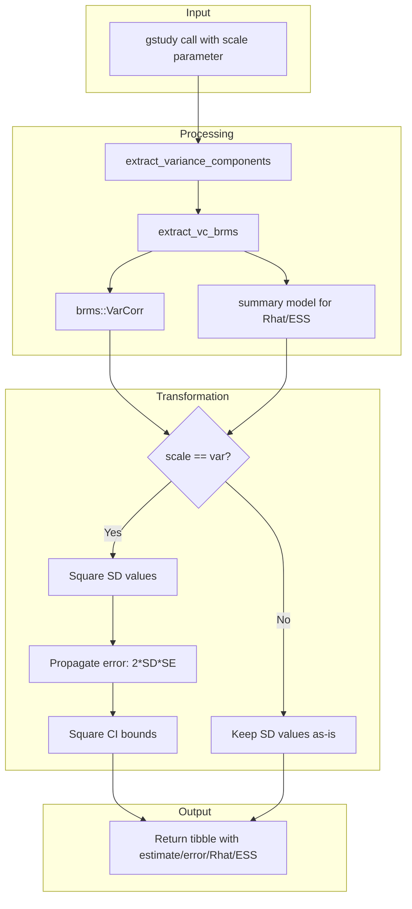

# Design: extract_vc_brms() Enhancement

## Overview

This document describes the design for enhancing `extract_vc_brms()` to:
1. Add new columns: `error`, `Rhat`, `ESS`
2. Convert SD to variance by default with a `scale` parameter to choose

---

## Current Implementation Analysis

### Current Function Signature

```r
# R/variance-components.R (line 205)
extract_vc_brms <- function(model, conf_level = 0.95)
```

### Current Output Columns

| Column | Description | Source |
|--------|-------------|--------|
| `component` | Name of variance component | Derived from VarCorr names |
| `facet` | Associated facet name | Same as component |
| `type` | "main", "interaction", or "residual" | Derived from component name |
| `estimate` | Point estimate (currently SD) | `sd_mat[, "Estimate"]` |
| `se` | Standard error | `sd_mat[, "Est.Error"]` |
| `lower` | Lower CI bound | `sd_mat[, "Q2.5"]` |
| `upper` | Upper CI bound | `sd_mat[, "Q97.5"]` |
| `pct` | Percentage of total variance | Calculated |

### Current Call Chain

```
gstudy()
  -> extract_variance_components(model, backend, ...)
      -> extract_vc_brms(model)  # No additional args passed currently
```

---

## brms VarCorr Output Structure

### Primary Data Source: `brms::VarCorr(model)`

The `brms::VarCorr()` function returns a list where each element contains:

```r
vc[[group_name]][["sd"]]  # Matrix with columns:
#   - Estimate   : Posterior mean of SD
#   - Est.Error  : Posterior SD of SD (standard error)
#   - Q2.5       : 2.5th percentile (lower CI)
#   - Q97.5      : 97.5th percentile (upper CI)
#   - Rhat       : NOT included here
#   - Bulk_ESS   : NOT included here
#   - Tail_ESS   : NOT included here
```

### Rhat and ESS Extraction

**Critical Finding**: Rhat and ESS are **NOT** in `brms::VarCorr()` output. They must be extracted from:

1. **Option A**: `summary(model)$random` - Contains Rhat and ESS for random effects
2. **Option B**: `brms::posterior_summary()` on extracted posterior samples
3. **Option C**: Direct extraction from `model$fit` (the underlying stanfit object)

**Recommended Approach**: Use `summary(model)$random` which provides:

```r
# For each random effect group, summary(model)$random[[group_name]] contains:
# - Estimate
# - Est.Error  
# - Q2.5, Q97.5
# - Rhat       : Convergence diagnostic
# - Bulk_ESS   : Effective sample size (bulk)
# - Tail_ESS   : Effective sample size (tail)
```

### Implementation Strategy for Rhat/ESS

```r
# Get model summary which includes diagnostic statistics
model_summary <- summary(model)

# For random effects, access via:
# model_summary$random[[group_name]]
# This gives a matrix with Rhat, Bulk_ESS, Tail_ESS columns
```

---

## Proposed Changes

### 1. New Function Signature

```r
extract_vc_brms <- function(model, 
                            conf_level = 0.95,
                            scale = c("var", "sd"))
```

**Parameter Details**:
- `conf_level`: Existing parameter, unchanged
- `scale`: New parameter with options:
  - `"var"` (default): Report variance (SD²)
  - `"sd"`: Report standard deviation (current behavior)

### 2. New Output Columns

| Column | Description | Source |
|--------|-------------|--------|
| `estimate` | Point estimate (SD or variance based on scale) | Transformed from `sd_mat[, "Estimate"]` |
| `error` | Standard error of estimate | Transformed from `sd_mat[, "Est.Error"]` |
| `lower` | Lower CI bound (transformed) | Transformed from `sd_mat[, "Q2.5"]` |
| `upper` | Upper CI bound (transformed) | Transformed from `sd_mat[, "Q97.5"]` |
| `Rhat` | Convergence diagnostic | `model_summary$random[[grp]]` |
| `ESS` | Effective sample size (bulk) | `model_summary$random[[grp]]` |
| `pct` | Percentage of total variance | Calculated |

**Note**: The `se` column will be renamed to `error` for consistency with the requirement.

### 3. Conversion Formulas

#### When `scale = "var"` (default):

| Quantity | Formula | Notes |
|----------|---------|-------|
| `estimate` | SD² | Square the SD estimate |
| `error` | 2 × SD × SE | Propagation of uncertainty: `Var(SD²) = 4 × SD² × Var(SD)` |
| `lower` | lower_SD² | Square the lower bound |
| `upper` | upper_SD² | Square the upper bound |

**Derivation of error propagation**:
```
If Y = X², then:
  Var(Y) = (dY/dX)² × Var(X)
         = (2X)² × Var(X)
         = 4X² × Var(X)
  SE(Y) = 2X × SE(X)
```

#### When `scale = "sd"`:

| Quantity | Formula | Notes |
|----------|---------|-------|
| `estimate` | SD | No transformation |
| `error` | SE | No transformation |
| `lower` | lower_SD | No transformation |
| `upper` | upper_SD | No transformation |

### 4. Rhat and ESS Handling

Rhat and ESS values are **scale-invariant** - they measure MCMC convergence and effective sample size, which are properties of the posterior samples, not the scale of reporting. Therefore:

- **No transformation needed** for Rhat and ESS
- Same values reported regardless of `scale` parameter

---

## Parameter Passing Through Call Chain

### Updated Function Signatures

#### `extract_vc_brms()`

```r
extract_vc_brms <- function(model, 
                            conf_level = 0.95,
                            scale = c("var", "sd"))
```

#### `extract_variance_components()` in R/backends.R

```r
extract_variance_components <- function(model, 
                                        backend, 
                                        ci_method = "none", 
                                        nsim = 1000, 
                                        boot.type = "perc",
                                        scale = c("var", "sd"),  # NEW
                                        ...)
```

#### `gstudy()` in R/gstudy.R

```r
gstudy <- function(formula, 
                   data, 
                   backend = c("auto", "lme4", "brms"), 
                   facets = NULL, 
                   object = NULL, 
                   ci_method = c("none", "profile", "boot"),
                   nsim = 1000,
                   boot.type = c("perc", "basic"),
                   scale = c("var", "sd"),  # NEW
                   ...)
```

### Call Chain Flow

```
gstudy(scale = "var")
  -> extract_variance_components(..., scale = scale)
      -> extract_vc_brms(model, conf_level, scale)
```

---

## Implementation Steps

### Step 1: Update `extract_vc_brms()`

1. Add `scale` parameter with default `"var"`
2. Extract Rhat and ESS from `summary(model)$random`
3. Implement conversion logic based on `scale` parameter
4. Rename `se` column to `error`
5. Add `Rhat` and `ESS` columns

### Step 2: Update `extract_variance_components()`

1. Add `scale` parameter
2. Pass `scale` to `extract_vc_brms()`
3. Note: lme4 backend does not have Rhat/ESS (set to NA)

### Step 3: Update `gstudy()`

1. Add `scale` parameter
2. Pass `scale` through to `extract_variance_components()`

### Step 4: Update Documentation

1. Update roxygen comments for all affected functions
2. Update man pages (auto-generated from roxygen)
3. Update vignettes if needed

### Step 5: Add Tests

1. Test `scale = "var"` produces variance values
2. Test `scale = "sd"` produces SD values (current behavior)
3. Test error propagation formula
4. Test Rhat and ESS extraction
5. Test parameter passing through call chain

---

## Edge Cases and Considerations

### 1. Zero or Negative SD Estimates

If SD estimate is 0 or negative (shouldn't happen but edge case):
- Variance would be 0
- Error propagation would be 0 or undefined
- **Recommendation**: Handle gracefully with warning if SD <= 0

### 2. Multivariate Models

Current code handles multivariate models (multiple responses). The same transformation logic applies:
- Each response variable has its own residual variance
- Rhat/ESS available per response

### 3. lme4 Backend

lme4 does not provide Rhat or ESS (frequentist method):
- Set `Rhat = NA_real_`
- Set `ESS = NA_real_`
- `scale` parameter still applies (lme4 reports SD by default too)

### 4. Column Naming Consistency

Current output has `se`, requirement asks for `error`:
- Rename `se` to `error` for brms backend
- Consider renaming for lme4 backend too for consistency

---

## Data Flow Diagram



---

## Summary of Changes

| File | Function | Change |
|------|----------|--------|
| `R/variance-components.R` | `extract_vc_brms()` | Add `scale` param, add Rhat/ESS extraction, implement conversion |
| `R/backends.R` | `extract_variance_components()` | Add `scale` param, pass to extract_vc_brms |
| `R/gstudy.R` | `gstudy()` | Add `scale` param, pass through |
| `man/*.Rd` | Various | Update documentation |
| `tests/testthat/test-gstudy.R` | Tests | Add tests for new functionality |

---

## Questions Resolved

1. **How does brms provide Rhat and ESS?**
   - Via `summary(model)$random[[group_name]]` - not in VarCorr output

2. **What parameters does extract_vc_brms() currently accept?**
   - `model` and `conf_level` only

3. **How should scale parameter be passed?**
   - Through entire call chain: gstudy -> extract_variance_components -> extract_vc_brms

4. **Conversion formulas:**
   - Variance: SD²
   - Error: 2 × SD × SE (propagation of uncertainty)
   - CI bounds: square the SD bounds
   - Rhat/ESS: no transformation needed (scale-invariant)